# Arkime

## **Introducción**

Los argumentos de su actual infraestructura de seguridad para almacenar y indentificar el tráfico de red en el formato estándar PCAP, proporcionado rapido, identifica el acceso. Una intuitiva e interfaz web simple es proporcionada navegando PCAP, buscando y exportando. Arkime expone APIs que permiten a los datos del PCAP y el formato de datos JSON ser descargados y consumidos directamente en la sesión. Arkime almacena y exporta todos los paquetes estándar en el formato PCAP, permitiendote además usar tu herramienta favorita de ingesta PCAP como Wireshark durante el proceso de tu analisis. 

## **Nota**
Arkime (anteriormente era Moloch) es de código abierto, capturas indexadas y busquedas en el sistema a larga escala.

El sistema Arkime esta constituido de 3 componentes:

* captura - Una aplicación C roscada que monitorea el tráfico de red, escrito en el archivo con formato PCAP en el disco, analizar la captura de paquetes, y enviar los metadatos (SPI data) a búsqueda elástica.

* vistas - Una aplicación node.js que se ejecuta por maquina capturada. Esto sostiene la interfaz de la web y lo transfiere de archivos PCAP.

* búsqueda elástica - la tecnología de base de datos de búsqueda que impulsa Arkime.

## **Requisitos**

En este laboratorio tu podras usar un **Ubuntu 20 CLI machine**. Para acceder a esta máquina tu necesitas conectarte a OpenVPN y a una conexión SSH.

Para obtener la IP de tu máquina tu debes acceder <a href=https://proxcp.cyberwarrior.com/>**https://proxcp.cyberwarrior.com/**</a>. Por favor escribir la dirección de la IP en algun lugar para recordarlo.

La credenciales de la máquina es:

**User:     root**

**Password: pass123**

### **Como**

Si no recuerdas como conectarte por SSH en Putty, ingresar a <a href="https://ds-lab-42.cyberwarrior.com/">Click</a>, para ver el video de instalacion y conexion.

### **Nota**
Por favor estar consciente que las imagenes y la direcciones de IP que aparecen en las guias podria no ser identica a las que se te han asignado. Si tienes cualquier pregunta, por favor consulte a su instructor.

## **Proceso de instalación**

Actualizar el sistema

Actualizar la cache de los paquetes del sistema;

**sudo apt update**

### **Instalar la captura completa del paquete Arkime**

Descargar el instalador binario Arkime:

**wget https://s3.amazonaws.com/files.molo.ch/builds/ubuntu-20.04/moloch_2.7.1-1_amd64.deb**

**sudo apt update**

Luego, instalar la herramiental de captura en el paquete completo Arkime (Moloch) en ubuntu usando el instalador binario descargado.

**sudo apt install ./moloch_2.7.1-1_amd64.deb -y**

### **Instalar la búsqueda elástica en Ubuntu**

Arkime usa la búsqueda elástica como un buscador e indexando el motor. Ademas, instalar la búsqueda elástica ejecutando los siguients comandos.

#### Importar la clave de firma del repositorio PGP del Elastic stack
wget -qO - https://artifacts.elastic.co/GPG-KEY-elasticsearch --no-check-certificate | sudo apt-key add -

#### Instalar la búsqueda elástica desde el repositorio APT
echo "deb https://artifacts.elastic.co/packages/7.x/apt stable main" | sudo tee -a /etc/apt/sources.list.d/elastic-7.x.list

Actualizar la cache del paquete e instalar la búsqueda elástica:

**sudo apt update**

**sudo apt install elasticsearch**

Configurar la búsqueda elasticaen las opciones JVM dependiendo del tamaño de su memoria. Por ejemplo: si tu tienes 2GB de ram, tu puedes asignar 512mb a cada uno.

**sudo nano /etc/elasticsearch/jvm.options**

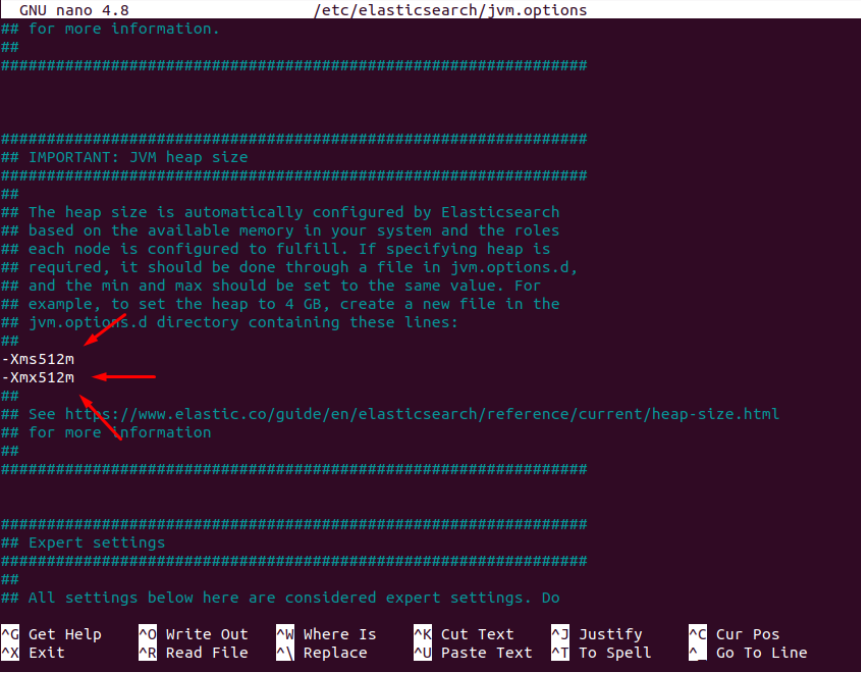

En esta parte hemos descomentado los parametros **Xms** y **Xmx** y asignamos el valor acorde a nuestra memoria como ves en la imagen de arriba. Yo tengo 2GB de ram entonces yo asigne 512mb a cada uno.

**CTRL + O = save CTRL + X = exit**

### **Configurar Arkime (Moloch) en Ubuntu**

Una vez la instalación ha terminado, ejecutamos el código de abajo para configurar Arkime (Moloch); pero primero necesitamos saber. Cual es el nombre de nuestra interfaz con el siguiente comando?

**ip a**

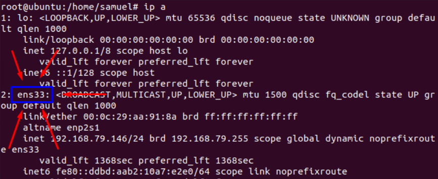

| Nota          |
| ------------- |
| Por favor remplazar ens33 por el nombre de la interfa z de red (eth0 por ejemplo)    |

Ahora iniciamos con la configuracion de Arkime

**/data/moloch/bin/Configure**

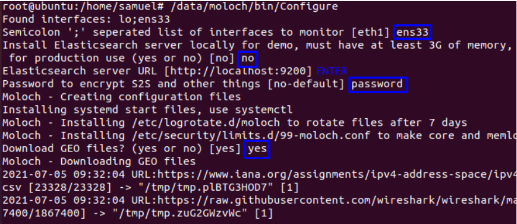

### **Ejecutando la búsqueda elástica**

Iniciar y habilitar la búsqueda elástica para ejecutar en el boot del sistema;

**systemctl enable --now elasticsearch**

 
Verificamos si la búsqueda elástica se esta ejecutando

*En caso de que no tengas instalada el curl, usa este comando:*

**sudo apt install curl**

*Verificamos si esto se esta ejecutando:*

**curl http://localhost:9200**

La salida debe ser esta:

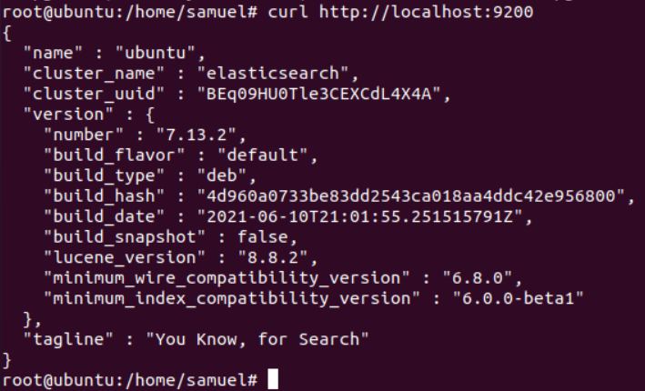

### **Inicializar la búsqueda elástica Moloch en la configuración**

Ejecutamos el comando de abajo para inicializar la búsqueda elástica Arkime/Moloch en la configuración.

**/data/moloch/db/db.pl http://localhost:9200 init**

### **Creamos una cuenta de usuario como administrador en Arkime/Moloch**

Ejecutamos el comando de abajo para crear la cuenta de usuario administrador Arkime/Moloch. Reemplazamos el usuario y la contraseña en consecuencia.

**/data/moloch/bin/moloch_add_user.sh admin "Moloch SuperAdmin" password --admin**

Nosotros solo configuramos las credenciales para Arkime, **admin** como un usuario y **password** como una contraseña.

### **Ejecutando los servicios Arkime**

Arkime se compone de 3 componentes:

* captura - Una aplicación C roscada que monitorea el tráfico de red, escrito en el archivo con formato PCAP en el disco, analizar la captura de paquetes, y enviar los metadatos (SPI data) a búsqueda elástica.

* vistas - Una aplicación node.js que se ejecuta por maquina capturada. Esto sostiene la interfaz de la web y lo transfiere de archivos PCAP.

* búsqueda elástica - la tecnología de base de datos de búsqueda que impulsa Arkime.

Ahora iniciamos y habilitamos la captura Moloch y vemos los servicios para ejecutar en el boot del sistema.

###### molochcapture
**sudo systemctl enable --now molochcapture**

**sudo systemctl start molochcapture**
 

###### molochviewer
**sudo systemctl enable --now molochviewer**

**sudo systemctl start molochviewer**

Verificamos si esto se esta ejecutando apropiadamente:

**sudo systemctl status molochcapture molochviewer**

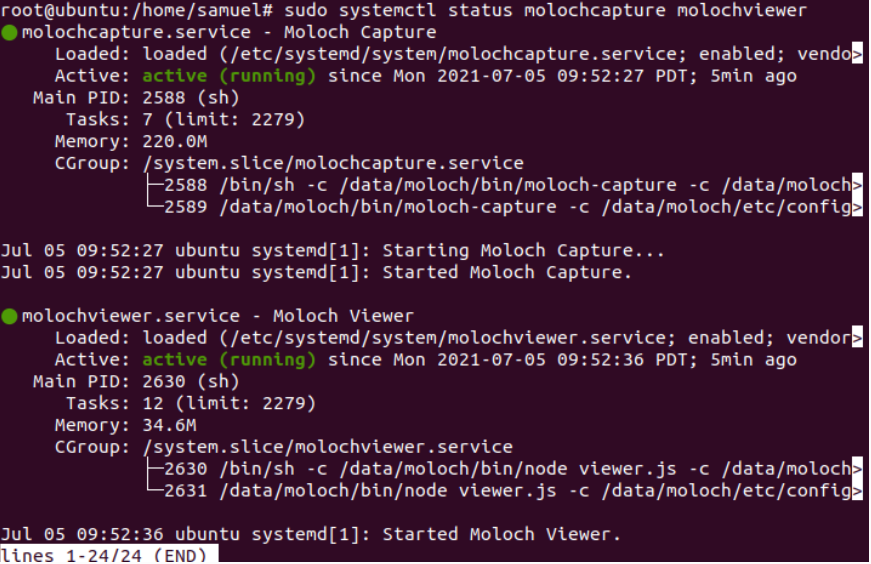

| Nota          |
| ------------- |
| Presionamos la letra **q** para salir, en caso que cualquier de esos servicios no se esten ejecutando solo reinicia tu máquina y habilita que todo los servicios se inicien otra vez.|

### **Accediendo a la interfaz Web de Arkime/Moloch**

Moloch esta alojado en el puerto 8005/tcp por defecto. Si UFW esta ejecutando, abrimos este puerto para permitir el acceso externo.

Tu puedes acceder entonces Arkime/Moloch usando la URL, **http://your_ip:8005** con su favorito navegador.

Entonces ponemos las credenciales que tu distes, las mias son **admin** y **password**:

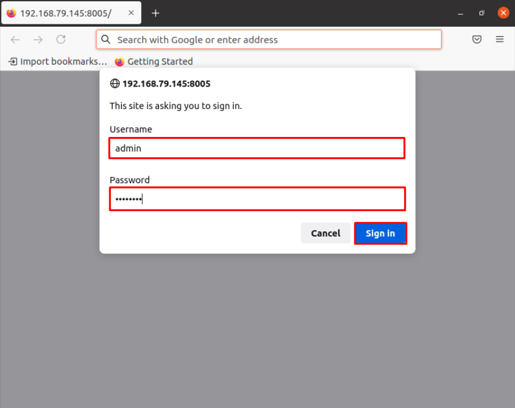

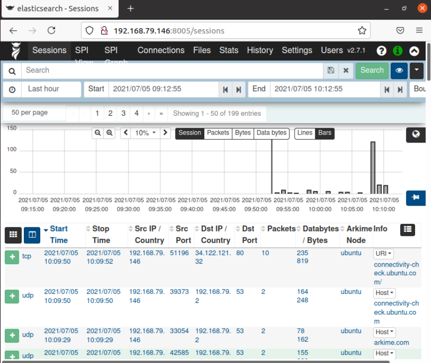

## **Introducción**

### **Tutorial Arkime: Identificando HOST y usuarios**

Cuando un anfitrión esta infectado o otra cosa esta comprometida, los profesionales de la seguridad necesitan revisar rapidamente las capturas de los paquetes (PCAPS) de los sospechosos tráficos de red para identificar los HOST y usuarios afectados.

Este tutorial te ofrece algunas pistas en como reunir información sensitiva de archivos PCAPS usando Arkime(Moloch). Esto asume que tu entiendes los fundamentos de tráfico de red y puedes usar estos PCAPS de IPV4 tráfico para cubrir la recuperación y administrar lo básico de esto:

* Administración de archivos
* Anfitrión de información del tráfico DHCP
* Modelos de dispositivos y sistema operativo 
* Destinaciones

## **Manos en Arkime**

#### **Información del HOST desde el tráfico DHCP**

Cualquier host esta generando tráfico dentro de tu red debes tener tress identificadores: una dirección MAC, una dirección IP y un hostname.

En muchos casos, alertas para actividades sospechosas estan basadas en una dirección IP. Si tu tienes acceso para llenar la capturas de paquetes de tu tráfico de red, un PCAP recuperado en una dirección interna IP debe revelar un dirección MAC asociada y un hostname.

Como nosotros encontramos información del HOST usando Arkime? Informacion DHCP podria ademas ayudarnos a identificar HOSTS de cualquier tipo de computadora conectada a tu red.

El primer PCAP para este tutorial,  **host-and-user-ID-pcap-01.pcap**, esta disponible aqui <a href="https://pa-lab-04.cyberwarrior.com/files/host-and-user-ID-pcap-01.pcap">Click</a> Este PCAP esta en una dirección IP en 172.16.1.207. Abrimos el PCAP en Arkime(Moloch).

###### Descargar el archivo usando wget, copiando el link dado abajo

**wget https://pa-lab-04.cyberwarrior.com/files/host-and-user-ID-pcap-01.pcap**

###### 1. Movemos el archivo PCAP a la locación y podemos trabajar con esto:

**mv host-and-user-ID-pcap-01.pcap /data/moloch/bin**

###### 2. Ahora podemos obtener adentro de la ruta, enviamos el PCAP y ejecutamos el código que podriamos importar al archivo dentro de Arkime:

**cd /data/moloch/bin**

**./moloch-capture -r host-and-user-ID-pcap-01.pcap**

Ahora tu puedes acceder a Arkime y confirmar que tengas el archivo subido nos dirigimos a la sección de los archivos.

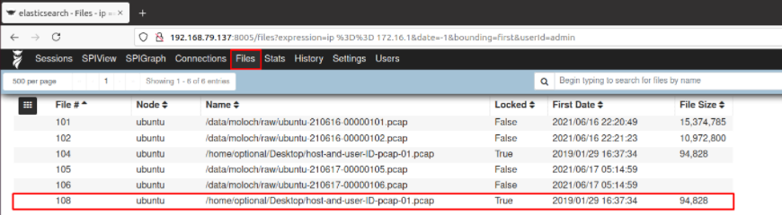

Ahora que tu tienes el archivo subido, podriames estar trabajando continuamente.

Sigue la siguiente ruta para encontrar la informacion del HOST del **tráfico DHCP**:

Selecciona las sesiones y escribe en el filtro **dhcp.type == REQUEST** para localizar todo los paquetes relacionados a DHCP, entonces presionamos en el reloj bajo el filtro y cambiamos todo cuidadosamente, finalmente presionamos **ENTER**

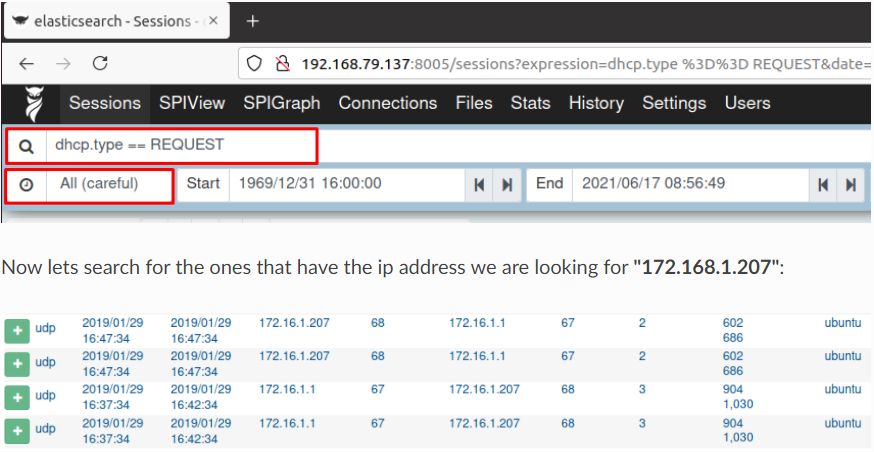

 

Veamos que tienen ellos dentro, abriendo cada uno de ellos.

| Nota          |
| ------------- |
| Presionar en los botones de despliegue verde para poder ingresar a las configuraciones|

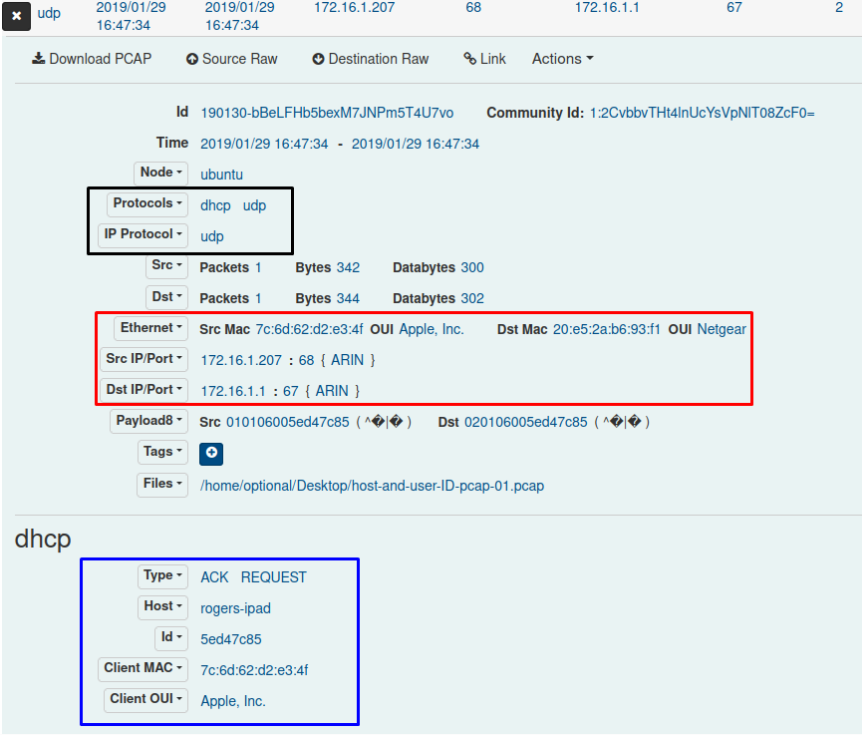

**Cuadro negro:** los protocolos que fueron usados en el paquete.

**Cuadro rojo: la fuente y destinacion de la informacion como:**

**Fuente**

* IP address: 172.168.1.207
* MAC address: 7c:6d:62:d2:e3:4f
* OUI: Apple, Inc.

**Destinacion:**

* IP address: 192.168.1.1
* MAC address: 20:e5:2a:b6:93:f1
* OUI: Netgear

**Cuadro azul:** aquí podemos encontrar la dirección MAC del cliente y **OUI** como bien, pero ademas el hostname del cliente: **Rogers-iPad**

Finalmente, podemos visualizar toda las destinaciones visitadas por nuestros clientes, escribiendo el siguiente comando en la sección de filtro de sesiones.

**ip.src == 172.16.1.207**
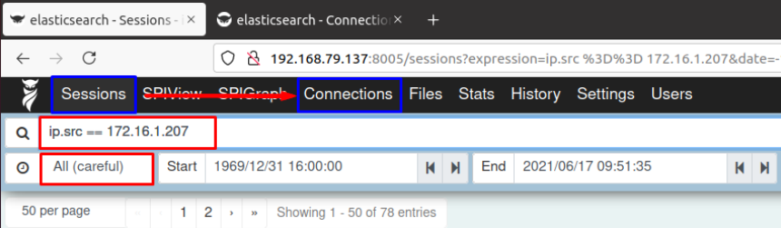

Entonces presionamos en la sección de conexiones para visualizar esto:

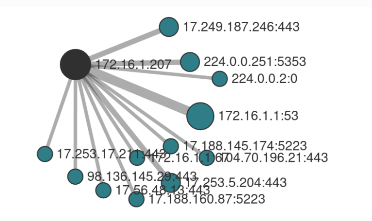

### **Resumen**

La identificación propia de los HOSTS y usuarios del tráfico de red es esencial cuando reportan actividad maliciosa en su red. Usando los metodos de este tutorial, podemos utilizar Arkime(Moloch) para ayudarnos a identificar los HOSTS y usuarios afectados.

## **Reto**

El segundo PCAP es para trabajar en, **host-and-user-ID-pcap-02.pcap** esta disponible <a href="https://pa-lab-04.cyberwarrior.com/files/host-and-user-ID-pcap-02.pcap">Aqui</a>. Su trabajo es reunir informacion vital que es requirida abajo:

* Fuente de la direccion IP
* Fuente de la direccion MAC
* Gateway
* Host name
* 3 HOSTS visitados por el cliente

Este PCAP es de un HOST Windows usando una direccion interna IP en 10.2.4.101. Abrir el PCAP en Arkime(Moloch). **Usa tu imaginacion y recueda pensar fuera de la caja**
