### \# Esta es Una guía paso a paso para instalar Caldera Mitre  en Ubuntu 2.0.04

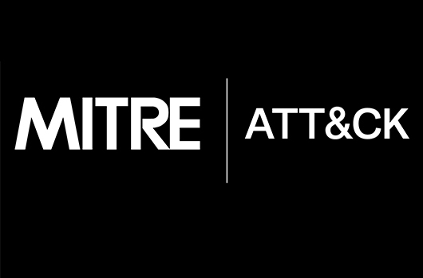

\*Escenario\*

` `Objetivos para este Laboratorio 

El objetivo de este laboratorio es: Aprender la manera de instalar y de utilizar CALDERA, una herramienta que se utilizara para dirigir ataques a gran escala, utilizando ataques muy eficientes, creando nuestro propio sistema de ataque, todo esto con el fin de mejorar nuestra infraestructura, seguridad de los equipos y utilizado como practica para nuestra defensa dentro de la organización.

¿Qué es Caldera o MITRE ATT & CK®?

MITRE ATT & CK es una colección documentada de información sobre los comportamientos maliciosos que los grupos de amenazas persistentes avanzadas (APT) han utilizado en varias etapas de los ciberataques del mundo real, el termino APT Como el nombre “avanzado” lo sugiere, es una amenaza avanzada persistente ( utiliza técnicas de hackeo continuas, clandestinas y avanzadas para acceder a un sistema y permanecer allí durante un tiempo prolongado, con consecuencias potencialmente destructivas, debido a la dificultad que implica llevar a cabo un ataque de esta Magnitud estos tipos ataques suelen asociarse con objetivos de gran valor, como Países y Corporaciones, con la Finalidad de robar información, durante un periodo prolongado de tiempo.

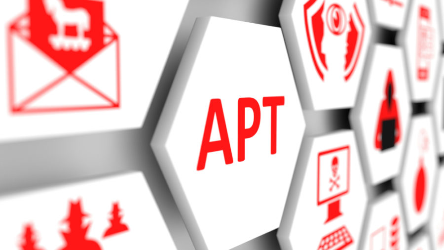

ATT & CK, que significa Tácticas, Técnicas y Conocimientos Comunes de Adversarios, incluye descripciones detalladas de las tácticas observadas de estos grupos (los objetivos técnicos que están tratando de lograr), técnicas (los métodos que utilizan) y procedimientos (implementaciones específicas de técnicas), comúnmente llamados TTP.

Aunque MITRE ATT & CK no es un modelo de amenaza a menudo se utiliza como base para que las organizaciones desarrollen sus propios modelos de amenazas personalizados. Considérelo como una referencia enciclopédica que describe las TTP

Mapear los TTP de un atacante puede ser de gran utilidad para **atribuir un ataque a un ciberatacante determinado**. Dado que muchos de los atacantes emplean las mismas técnicas (o relacionadas) en cada uno de sus ataques, atribuir un ataque a un atacante específico ayuda a acelerar la atribución y hacer que la respuesta y remediación sea más efectiva. 

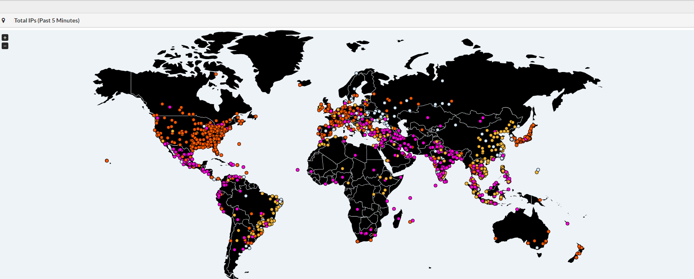

Conocer los ataques que usan los adversarios, proporciona sugerencias para la detección y mitigaciones comunes para técnicas específicas y perfila las prácticas conocidas, las características y las atribuciones de ataques específicos de los grupos de APT. ATT & CK también proporciona una lista extensa de software utilizado en ataques (tanto malware como código abierto y disponible comercialmente que se puede usar legítima o maliciosamente). Toda la información capturada en ATT & CK proviene de datos e informes disponibles públicamente, así como de la comunidad: investigadores de amenazas y equipos de seguridad en las trincheras que experimentan o analizan ataques a diario. 

**Terminología que debemos usar con este
framework mitre – caldera.**

`      `**AGENT**

- Es un simple programa de software. 
- No requiere de instalación de un programa en el equipo a ser evaluado 
- Es el encargado de **CONECTAR** a **CALDERA**, recibe las instrucciones (comandos) y regresa el resultado a caldera. 
- **CALDERA** incluye un plugin llamado **Sandcat**, es nuestro agente por default. 51

` `**GROUP**

- Un grupo es un conjunto de Agentes conectados a caldera. 
- Un grupo permite iniciar una operación hacía muchas computadoras 
  al mismo tiempo en vez de una a una. 
- El grupo por default al que los agentes se registran de forma automática se llama: **my\_group** 

`      `**ABILITY (habilidad)**

- Una habilidad es una implementación específica de una técnica del **ATT&CK**
  (procedimiento). 
- Las habilidades se crean en formato **YML** y se cargan en **CALDERA** cada
  vez que se inicia. 
- Todas las **Abilities** son almacenadas en el **plugin Stockpile** con los perfiles que las utilizan.

` `**ADVERSARY**

- Un Adversario es **conjunto** de **Abilities**, pueden ser clasificadas o utilizadas en fases… tal cual lo muestra la matriz **ATT&CK.** 
- Pueden ser creadas a través de la **GUI** o en formato **YML** y almacenados en **data/adversaries**. 

`       `**#Nota:** Adversario es un conjunto de **abilities** ejecutados en una o más fases de ataque.

`       `**OPERATION**

- Una operación se inicia cuando lanzas un adversario a un grupo e inicias la instrucción que ejecute       todas las habilidades (**abilities**) capaces.requiere de configuración previa.

`       `**FACT (una cadena de texto)**

- Un “**fact**” es información identificable sobre un host en particular. 
- Las **fact** estan directamente relacionadas con las variables, es decir, son el resultado de las instrucciones, que serán utilizadas por las habilidades. 

**Ejemplo:
host.user.Nombre
host.user.Contraseña**

`  `**SOURCE**

- Una fuente es una **colección** de **facts** que ha agrupado. 
- Una fuente de **fact** se puede aplicar a una operación.cuando la inicia. 
- Los fact proporcionan información a las variables que serán utilizadas por las habilidades.

`  `**RULE**

- Una regla es una forma de restringir o colocar límites en **CALDERA**. 
- Las reglas están directamente relacionadas con las **fact** y deben incluirse en una hoja de datos (**ATT&CK**). 

**PLANNER**

Es un módulo dentro de **CALDERA** que contiene la lógica de cómo una operación en ejecución debe tomar las decisiones sobre qué habilidades usará y en qué orden.

`     `**PLUGIN**

- **CALDERA** está construido utilizando una arquitectura de plugins en la parte superior del sistema central. 
- Los **plugins son repositorios separados de git** que conectan nuevas
  funcionalidades en el sistema central. 
- Cada plugin es almacenado en el directorio de plugins y se carga a caldera añadiéndolo en el archivo de configuración **default.yml** 

`     `**SERVIDOR**

Por default **CALDERA** se inicializa en el **puerto 8888** con los siguientes plugins cargados:

- **Sandcat**
- **Stockpile**
- **Compass**
- **Terminal** 

**\*Objetivos del Laboratorio\***

- Instalar la Herramienta
- Familiarizarce con el entorno de la Herramienta
- Aprender automatizar actividades en Red Team

**\*Requerimientos del Laboratorio\***

\* Maquina Ubuntu 20.04 (Preferible virtual para poder practicar la instalación)

\* Mantener nuestra máquina virtual actualizada

Duración del laboratorio: 30 minutos

**Para Comenzar este Laboratorio:** 

` `Prepare una máquina virtual con Ubuntu 20.04, Memoria del sistema de 4 GB a 25 GB de espacio libre en el disco duro, memoria Ram 4 Gb. 

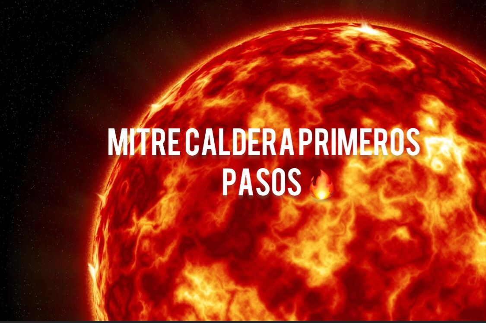

#### **###Pasos  para Instalar CALDERA**

**Una línea para instalar Caldera en Ubuntu**

Si es de los que les agrada la instalación de una sola línea, entonces le hemos facilitado la vida :). Debe tener en cuenta que no hemos cubierto la instalación del software recomendado en esto.

sudo apt update && sudo apt -y upgrade && sudo apt -y install python3-pip git && git clone https://github.com/mitre/caldera.git --recursive --branch 3.1.0 && cd caldera && pip3 install -r requirements.txt && python3 server.py –insecure

Pasos detallados para instalar Caldera en Ubuntu 20.04 

### **##Paso 1** 

Lo Primero que haremos es actualizar los repositorios instalados en nuestro equipo, esto lo realizamos con comando:

sudo apt-get update &&  sudo apt-get upgrade -y

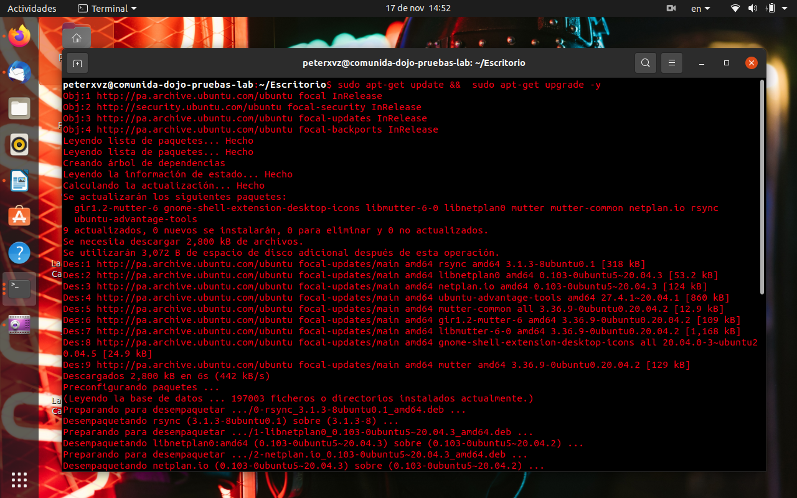

Luego de actualizar nuestra maquina podemos clonar el repositorio de  Caldera  desde Github:

`  `**git clone https://github.com/mitre/caldera.git --recursive --branch 3.0.**

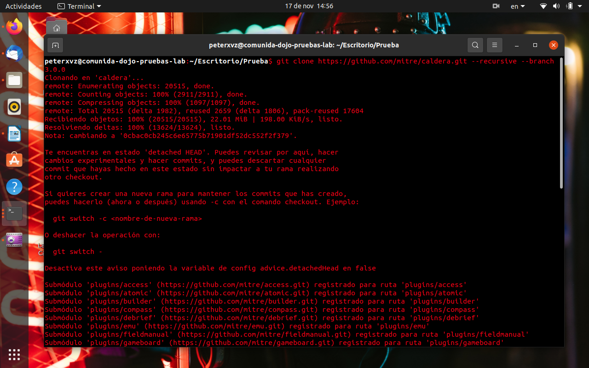

### **### Paso 2 - Ir a la carpeta CALDERA e instalar las dependencias.**

Encontrará una carpeta caldera en su directorio actual. Lo siguiente es instalar todos los requisitos por caldera. Para iniciar, con el comando “ls” podremos listar los archivos dentro de la carpeta donde nos encontremos, y con el comando “cd” podremos ingresar o cambiarnos de carpeta.

Para este paso ingresaremos con “cd” donde se encuentra CALDERA. Una vez dentro de la carpeta de CALDERA volveremos a colocar el comando “ls” para ver los archivos contenidos en esta Carpeta. \*(Utiliza el comando pwd para saber en qué carpeta te encuentras) \*

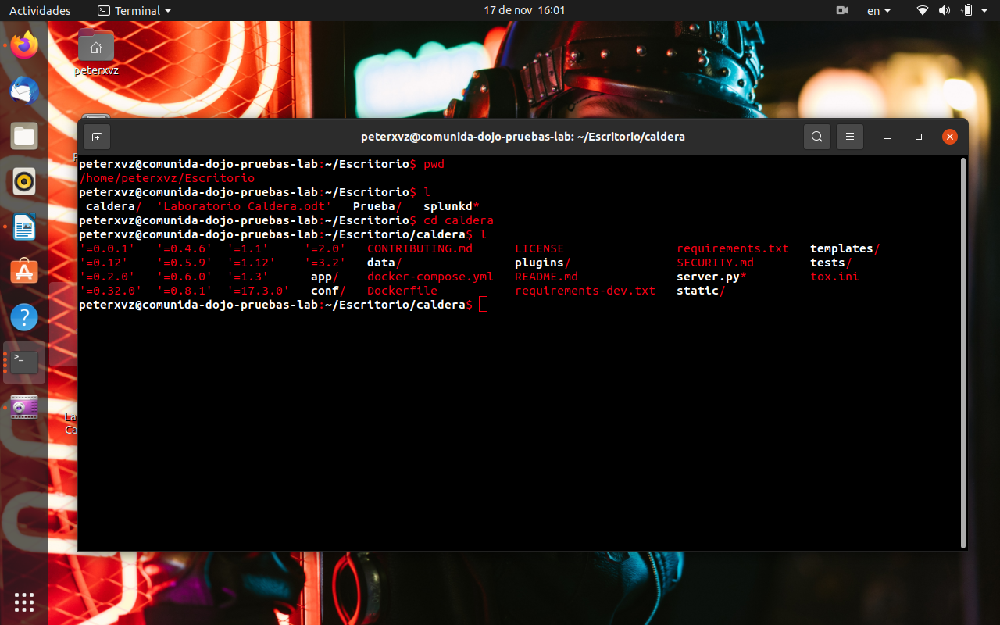

### **### Paso 3 - Instalación de Requerimientos**

\*Nota\*: para realizar este comando debemos tener previamente instalado python3, pero mediante el comando\*sudo apt install python\* y \*sudo apt install python3-pip\* lo podemos obtener.

sudo apt install python3

sudo apt install python3-pip

sudo apt install curl 

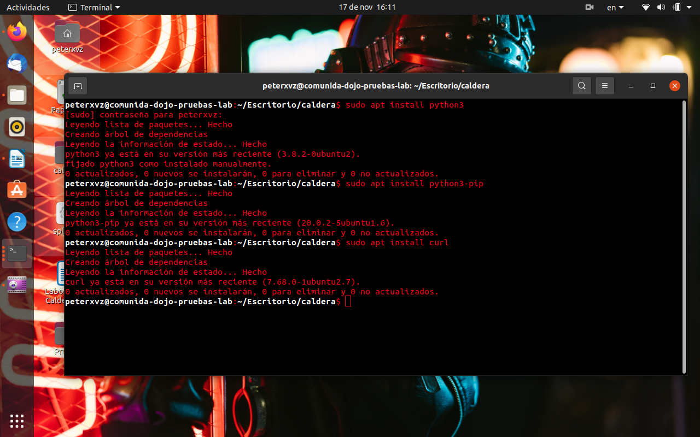

**Instalamos los requisitos necesarios para CALDERA.**

pip3 install -r requirements.txt

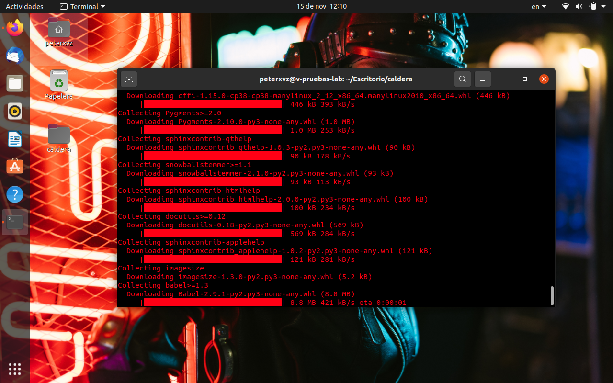

### **### Paso 4 - Iniciar CALDERA**

Usando el comando:

python3 server.py --insecure

iniciamos el servicio CALDERA para poder usarlo.

\* Nota: si cerramos la pestaña el servicio se apagará, por lo que es conveniente no tener interacción con esta pestaña.

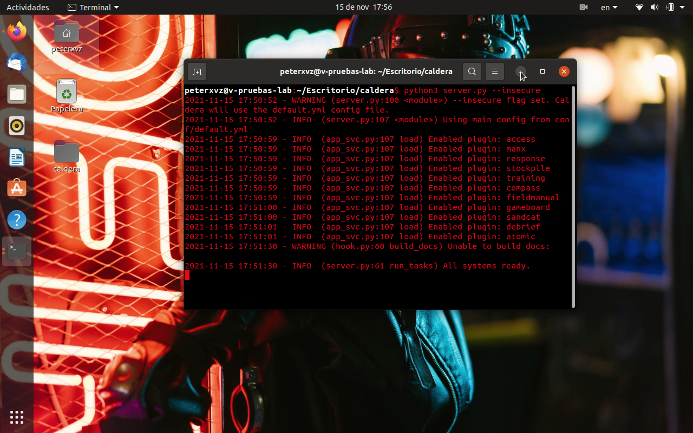

\### Nota (error versión de golang)

Si al momento de iniciar el servicio de caldera aparece el siguiente error \*(go does not meet the minumun version of 1.11)\* por favor seguir los siguientes comandos para instalar/actualizar la versión de \*golang\*:

\* Descargar la última versión de go :<https://golang.org/doc/install>

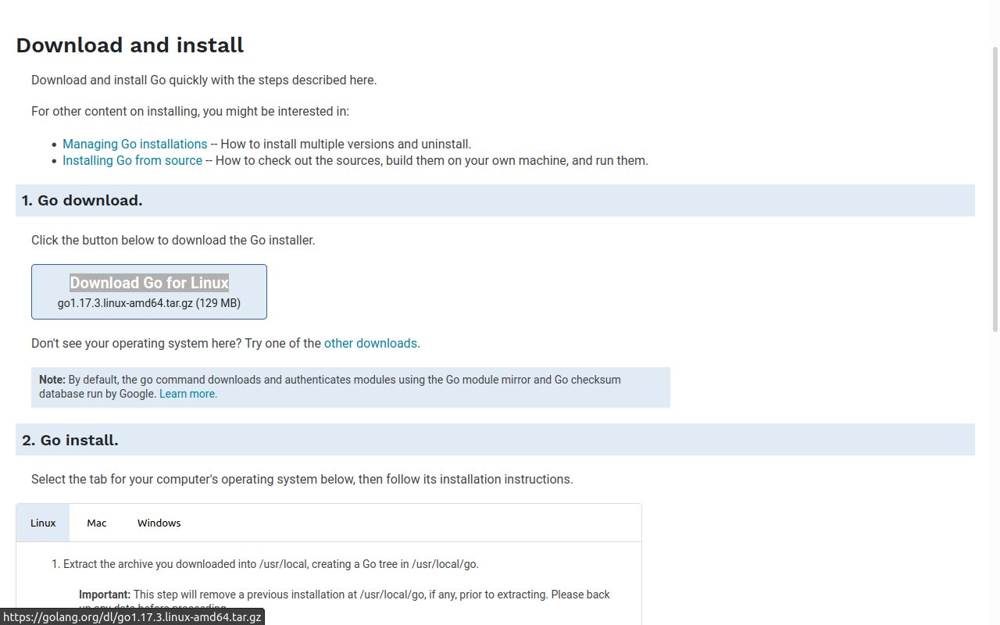

\* Ir a **Descargas** y copiar el archivo de Golang

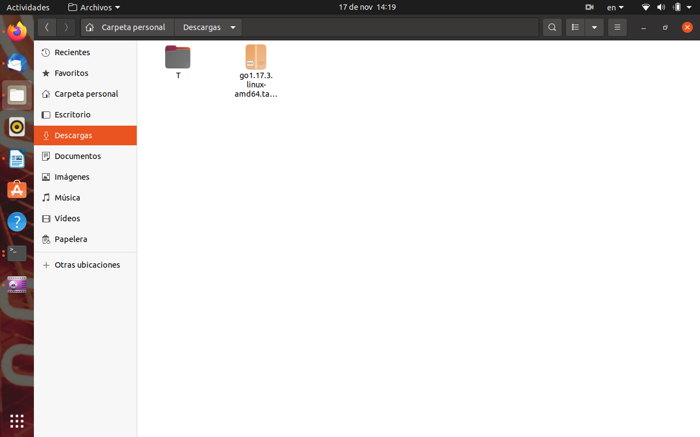

\*Mover Golang a *usr*/local, Sintaxis del Comando: sudo mv nombre-de-larchivo Ubicación

`  `sudo mv  go1.17.3.linux-amd64.tar.gz  /*usr/local*

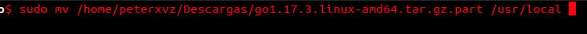

\*Extraer en / usr / local usando el siguiente comando. Estoy usando Go 1.17.3 aquí. Es posible que deba reemplazar el nombre de archivo con el nombre de archivo real según la versión que haya descargado.

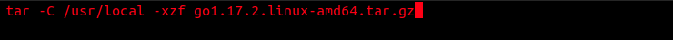

\*Archivos extraídos

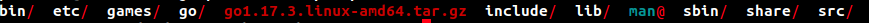

\* Crea el directorio .go en casa. (Es fácil instalar los paquetes necesarios sin privilegios de administrador)

mkdir ~/.go

\* Configure las siguientes variables de entorno

GOROOT=/usr/local/go

GOPATH=~/.go

PATH=$PATH:$GOROOT/bin:$GOPATH/bin

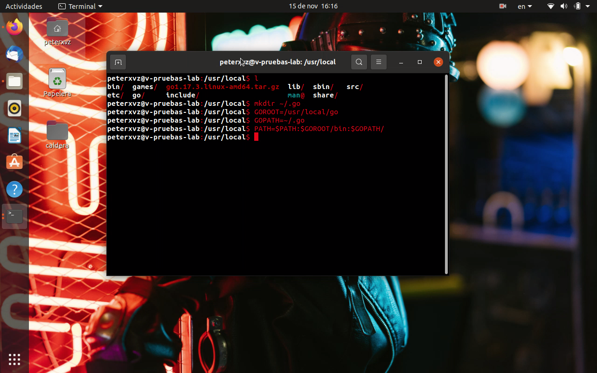

**Actualice el comando go**

sudo update-alternatives --install "/usr/bin/go" "go" "/usr/local/go/bin/go" 0

sudo update-alternatives --set go /usr/local/go/bin/go

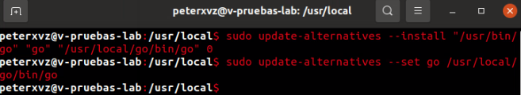

**Prueba la versión de golang**

go version

Una vez realizado estos pasos, podemos regresar a la carpeta CALDERA y ejecutar el comando:

python3 server.py –insecure

De estar todo bien, habremos eliminado el error \*(go does not meet the minumun version of 1.11)\*

- ### **### Paso 5 – Inicio de sesión en CALDERA**

Para iniciar sección en CALDERA debemos saber cuál es nuestra dirección **IP** y luego a la misma agregarle el puerto \_8888, por ejemplo **IP:8888** , o también podemos colocar en el navegador **localhost:8888** ,Debemos descargar **net-tools** para poder verificar nuestra dirección ip

 Utilizar el comando: 

**sudo apt install net-tools**

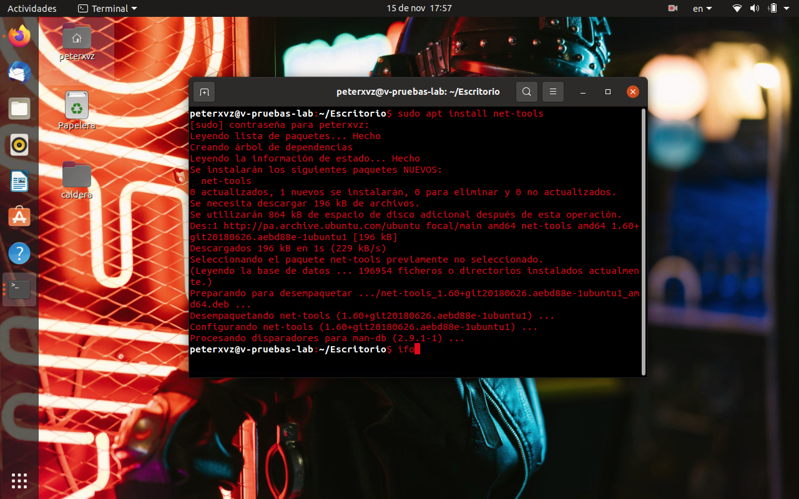 

Para saber nuestra dirección IP debemos introducir el comando **ifconfig** , sin olvidar de instalar previamente el paquete de herramientas \**NET** si nos muestra un error, el cual lo podemos instalar utilizando el comando

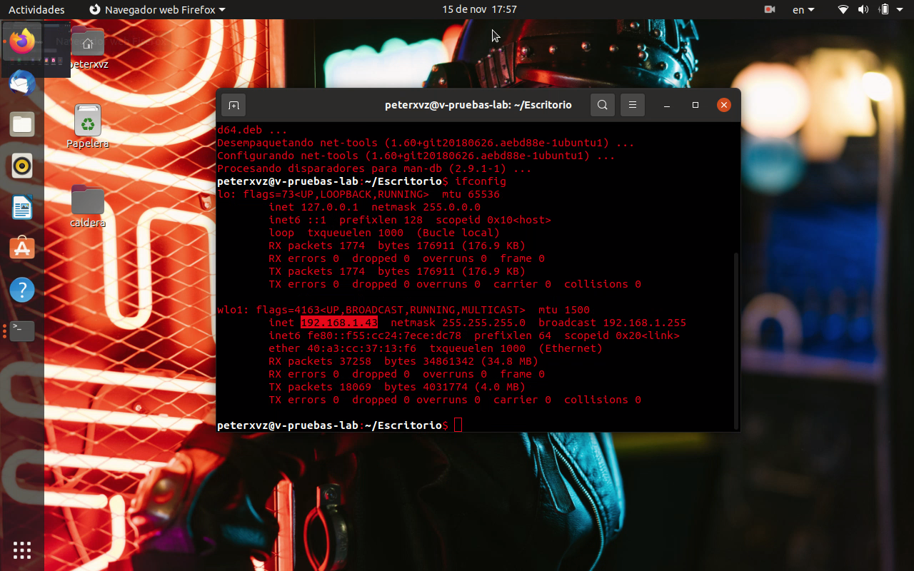

**INICIAR DE SESICION EN CALDERA **

CALDERA tiene diferentes ambientes para iniciar, por ejemplo, tenemos la opción para **RED TEAM** y **BLUE TEAM**

Primero Ingresaremos al perfil de RED TEAM con las siguientes credenciales:

**USER:admin  PASS:admin**

Y seguidamente ingresaremos al perfil BLUE TEAM con las siguientes credenciales:

**USER: blue  PASS:admin** 

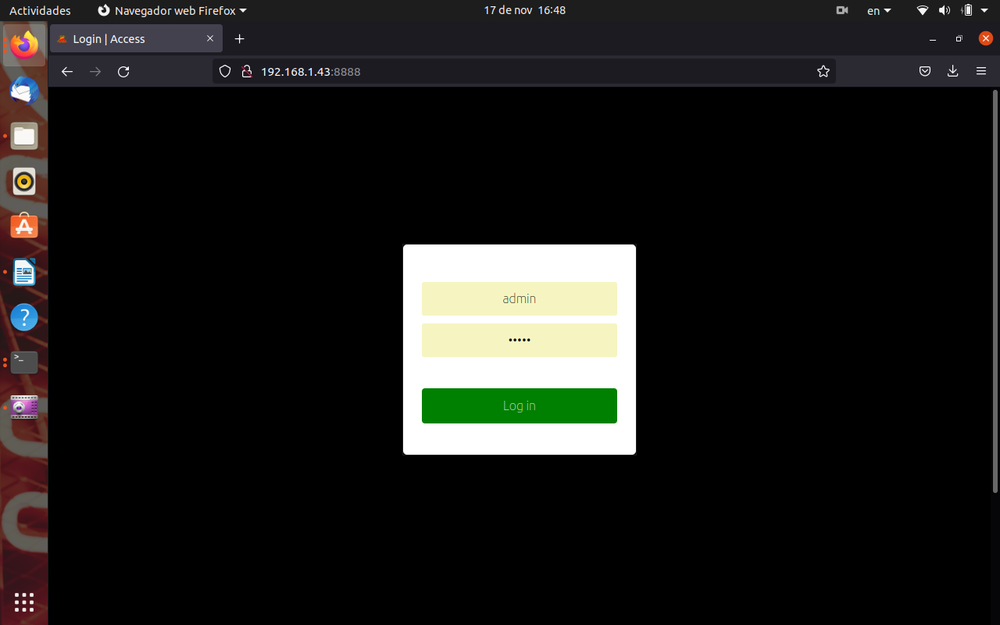

\## Nota (Equipos)

**PAGINA DE INICIO DEL EQUIPO ROJO**

Aquí podemos ver el inicio de sesión en el grupo del equipo rojo, el equipo rojo se identificará con una franja azul en la parte inferior de la página

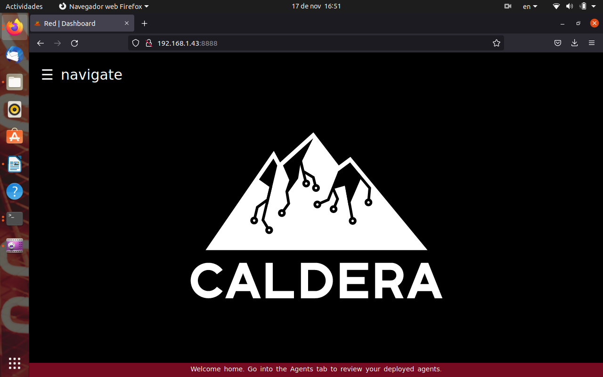 

### **Paso # 6 Desplegar un Agente**

\### Nota 1

Aquí tenemos el menú de opciones para empezar a trabajar con Caldera

#### **Paso 1 - ir al menu de agentes**

`En` el menú de agentes podemos desplegar una aplicación que se ejecutará en segundo plano en la máquina que la coloquemos, y conectará automáticamente esa máquina a CALDERA.

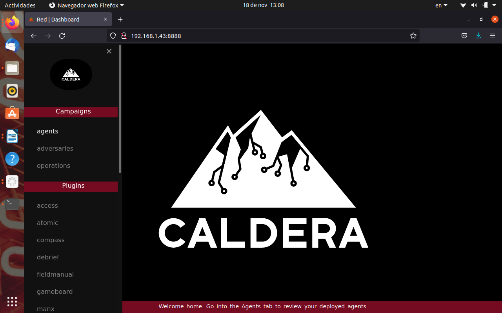

#### Paso 2 - Configuración del perfil de un agente**

Para desplegar un agente existen varias opciones, pero 54ndc47 o sancat es la más utilizada para conectar máquinas a CALDERA. (Para desplegar: **click here to deploy an agent**)

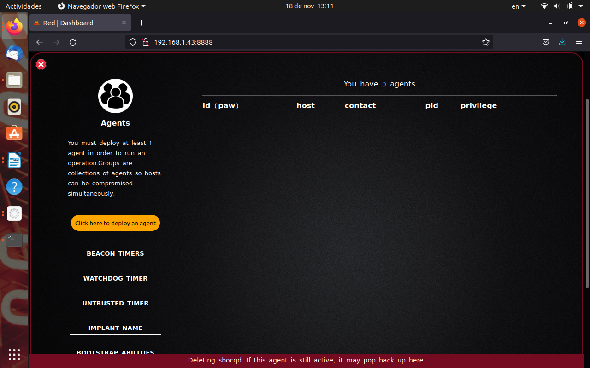

** Pasos a seguir para desplegar un agente**

 elegir esta opción, elegir sancat, el sistema del equipo, copiar el comando que tenemos a continuación y pegarlo en la consola del sistema que queremos agregar a caldera.

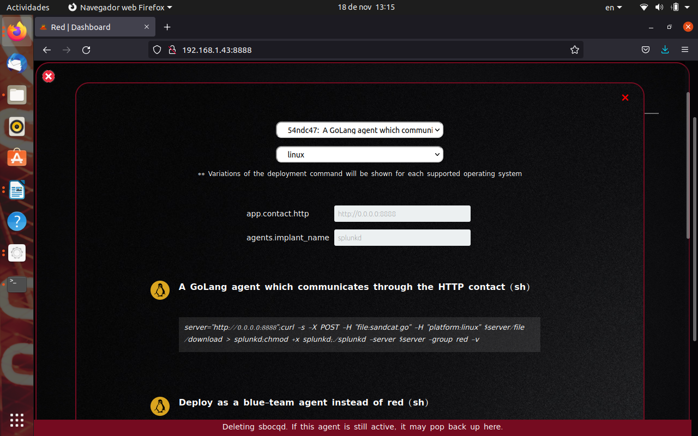

#### ###Paso 3 - Copiar el Script**

A continuación, se muestra un ejemplo de lo explicado anteriormente, una vez pegado presionamos enter y se ejecutará el proceso, luego lo minimizamos y continuamos.

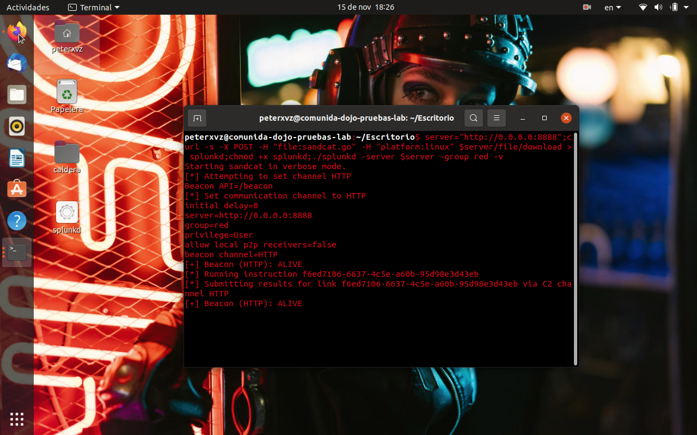

Aquí podemos ver como la maquina ya está conectada de manera correcta en la consola de CALDERA.

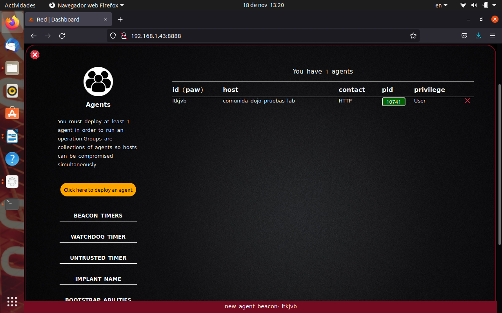

### **### Paso 7 - Ir Al menú de Entrenamiento**

En la pestaña de entrenamiento podemos ver que podemos agregar nuestra máquina host y otras máquinas para ser examinadas también y para llevar a cabo este proceso debemos usar nuestras habilidades en el equipo rojo.

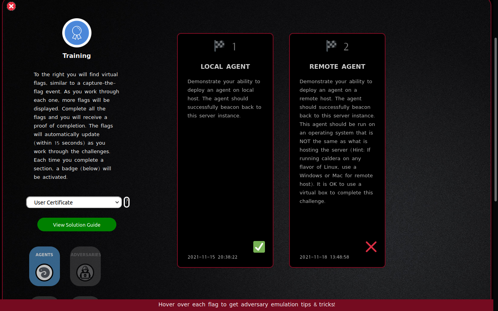

\# 4. ¿Cómo Ejecutar un agente?\*\*

#### **### Paso 1 - Menú de Operaciones**

En la pestaña de operaciones podemos elegir el tipo de ataque que queremos realizar en las máquinas que tenemos conectadas a CALDERA. Por ejemplo, podemos usar la opción Operaciones, para que podamos ver todos los archivos e información sensible que tiene la máquina.

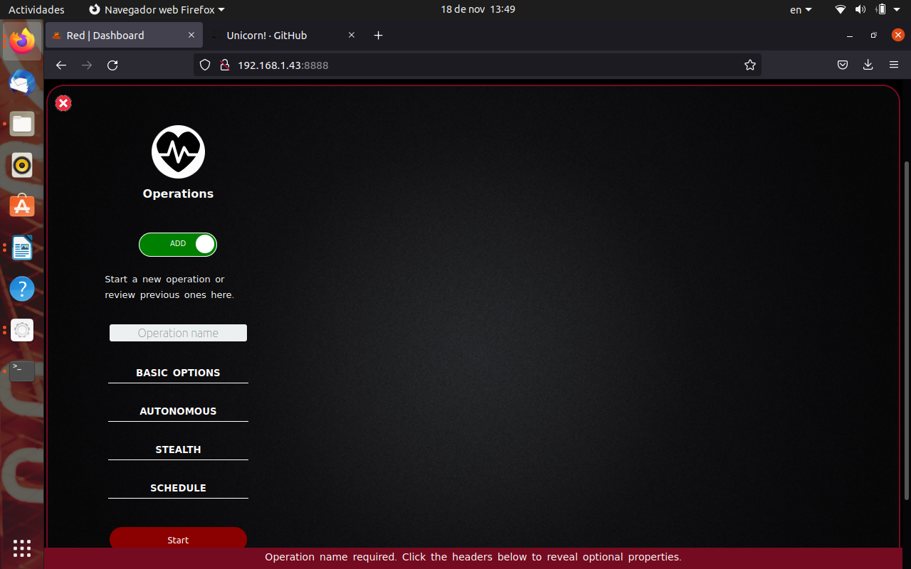

#### **### Paso 2 - Creación de una Operación**

Para iniciar una operación, primero debemos colar el nombre de esta, luego elegir si es a todos los usuarios o a la red de máquinas que tiene BOILER conectadas, luego elegimos el tipo de ataque que queremos realizar, todos y cada uno de estos se puede ver en la página de Mitre ATT&CK, y las otras opciones se pueden dejar por defecto![Pantalla de computadora

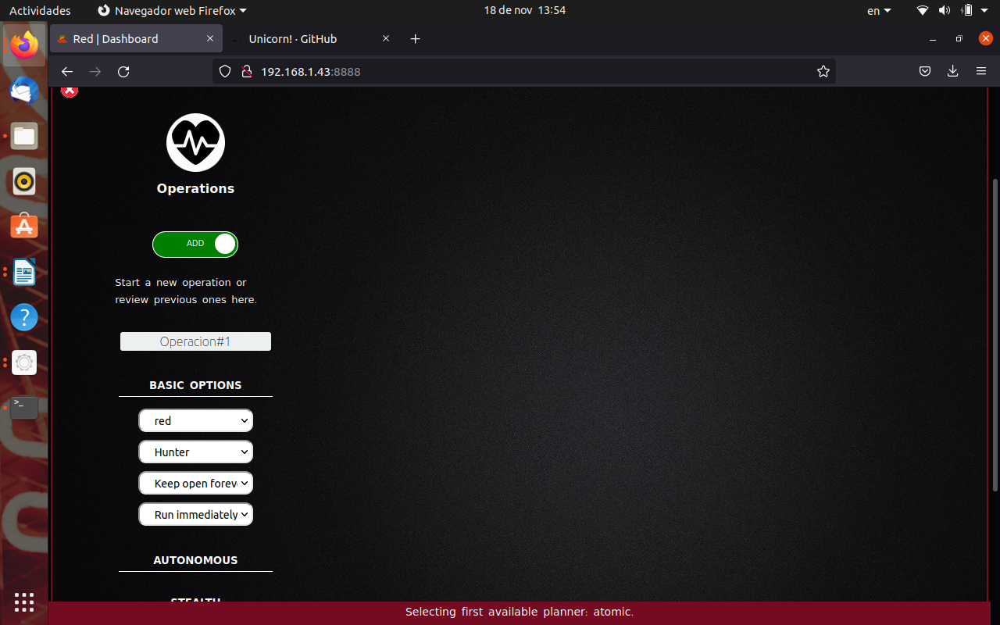

\### Nota 1

Una vez configurados los pasos anteriores, presione inicio y automáticamente comenzará a realizar los procesos relacionados con el tipo de ataque. 

Por ejemplo, recopilación de información, escaneo de vulnerabilidades, verificación de versiones de los sistemas y programas, entre otros. al hacer clic en la estrella podemos ver la información recopilada.

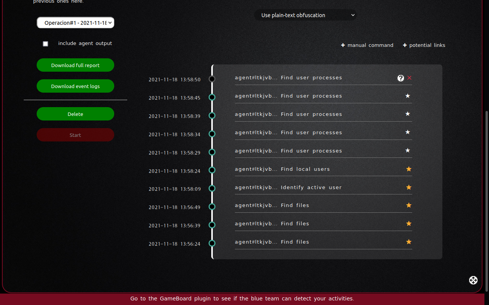

#### **### Paso 3 - Menú del perfil de adversario**

En la pestaña de perfiles del adversario podemos ver los tipos de ataques y los procesos que realizan, en este menú podemos personalizar un ataque que queramos con las habilidades y características de varios ataques.

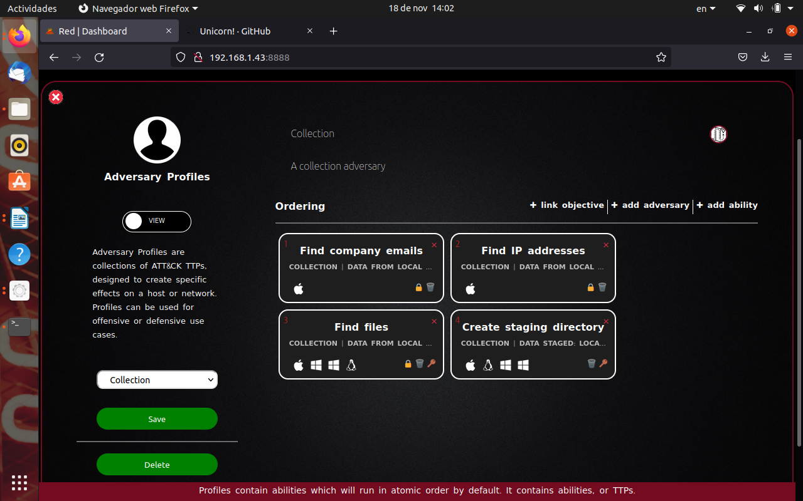

#### **### Paso 4 - Ir al Menú Debrief**

En la pestaña Debrief podemos seleccionar las operaciones que hemos realizado anteriormente y ver un mapa gráfico de los procesos que realizamos para ello.

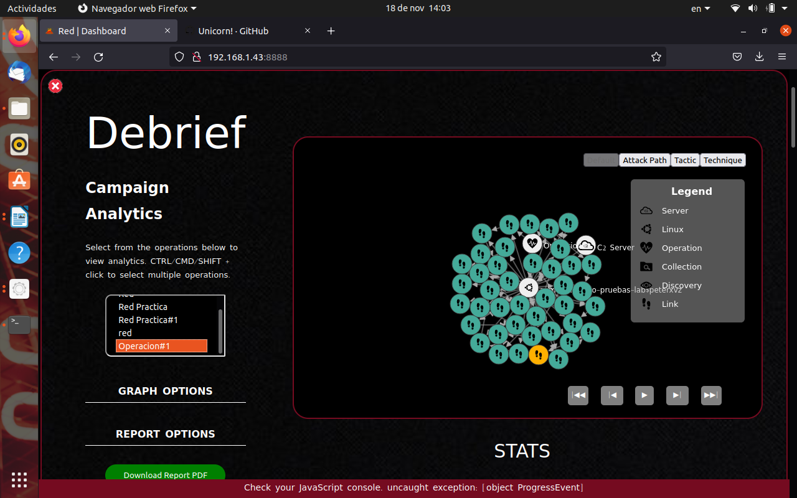

#### **### Paso 5 - Ir Al Menú Compass**

` `CALDERA muchas veces no encontramos todos los ataques que podemos encontrar en la página de Mitre ATT&CK, y por eso si queremos aprovechar los ataques de uno de los grupos criminales o terroristas más afectivos, en la pestaña BRÚJULA podemos importar el ataque y cargarlo en CALDERA.

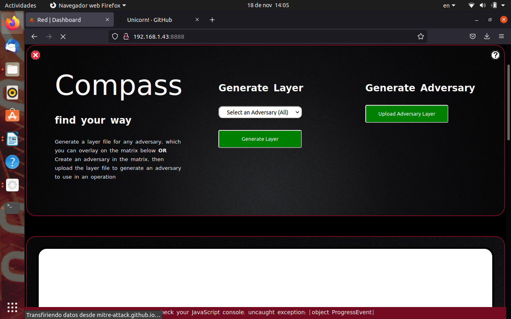

#### **### Paso 6 - Descargar el tipo de Ataque**

Primero debemos descargar el tipo de ataque que queremos, lo lograremos visitando la página de https://attack.mitre.org/ y seleccionamos Grupos

Luego hacemos clic en Grupos y seleccionamos APT-1

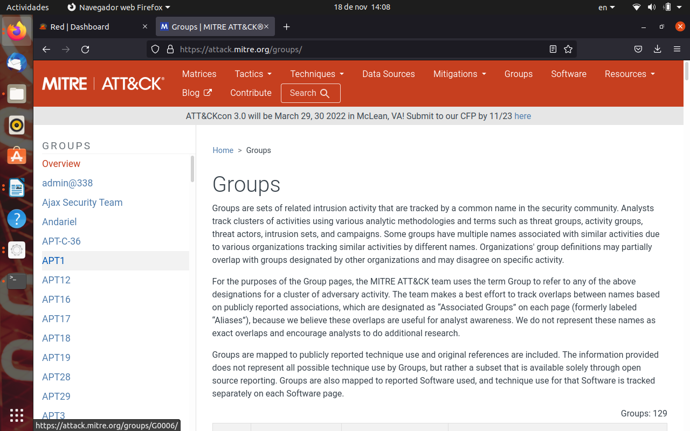

Buscamos la pestaña de capas del navegador ATT&CK, desplegamos el menú de opciones y elegimos la opción de descargar, y luego OK.

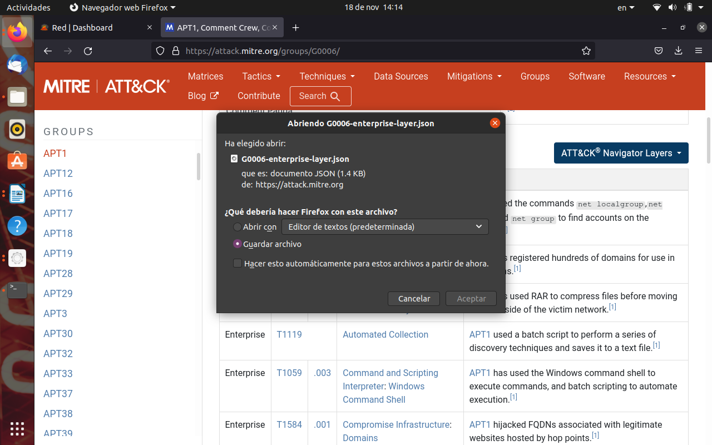

**### Paso 7 - Cargar el Ataque**

Selecionamos **Upload Adversary** Layer para cargar el ataque 

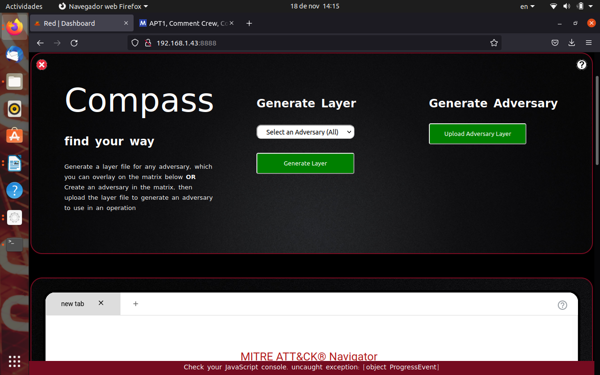Una vez descargado damos en COMPASS para subir la capa adversaria, cargamos el archivo y se subirá automáticamente.

#### **### Paso 8 - Buscar el Ataque**

Si vamos al menú de perfil de adversarios, buscamos el ataque que hemos cargado y aparecerán todos los procesos que podemos realizar con él.

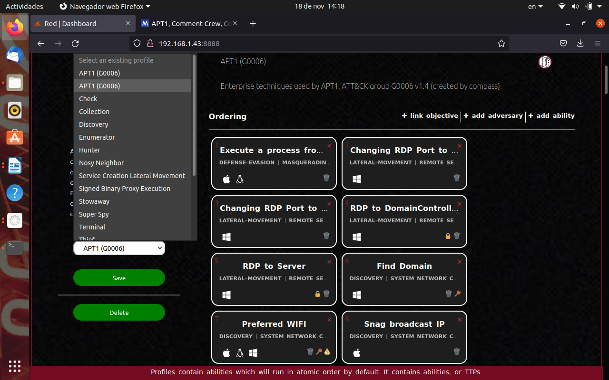

#### **### Paso 9 - Seleccionar el Ataque**

Podemos elegirlo para hacer una operación con el fin de comprometer a un equipo y obtener sus credenciales. Esto lo realizamos en el menú de operaciones.

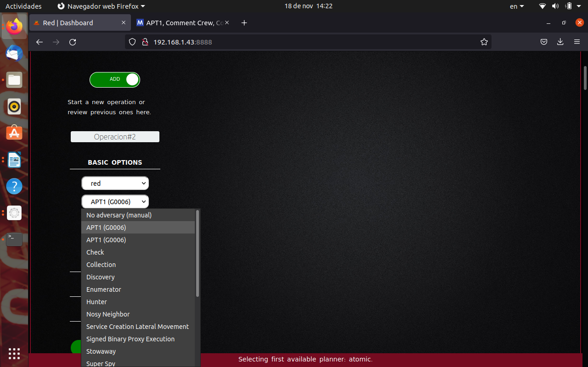

#### **## Paso 10 - Iniciar el ataque y mirar los resultados**

En nuestra operación hemos encontrado el archivo passwd, que es donde se almacenan las contraseñas en los sistemas Linux y aquí muestra una lista de las posibles contraseñas de nuestro sistema gracias a una de las operaciones de recolección del ataque realizado.

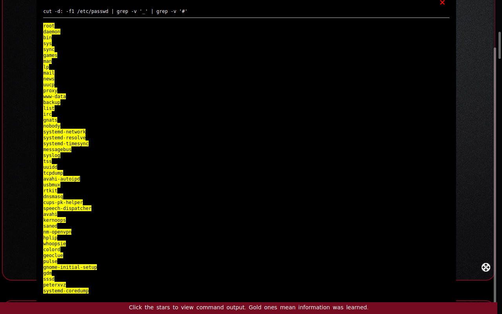

### Conclusión 

MITRE ATT & CK es un repositorio de información altamente detallado y con referencias cruzadas sobre grupos adversarios del mundo real y su comportamiento conocido; las tácticas, técnicas y procedimientos que utilizan; instancias específicas de sus actividades; y el software y las herramientas que emplean (tanto legítimos como maliciosos) para ayudar en sus ataques. Diseñado desde el punto de vista de un atacante, MTRE ATT & CK se distingue de otros modelos de ciclo de vida de ciberataques y modelos de amenazas centrados en defensores y basados ​​en riesgos. Esto la convierte en una herramienta valiosa para ayudar a las organizaciones a obtener información sobre el comportamiento de los atacantes para que puedan mejorar sus propias defensas en consecuencia.

Debido a la gran cantidad de información que proporciona ATT & CK es difícil de comprender solo con una descripción. Puede comprender mejor la profundidad de su valor si reserva una o dos horas para explorarlo por su cuenta. No te arrepentirás de haberlo hecho

\# 5. Material Adicional\*\*

[CALDERA: Automating Adversary Emulation] https://www.youtube.com/watch?v=fx3635hLewg

[To Download CALDERA] https://github.com/mitre/caldera

[Documentation] https://caldera.readthedocs.io/en/latest/

[Documentation:] https://readthedocs.org/projects/caldera/

[SPONSOR TALK! Mitre's Caldera] https://youtu.be/YNIxwNLF7dc

[Documentation:] https://natasec.com/mitre-caldera-primeros-pasos/

[CALDERA: Automating Adversary Emulation] https://youtu.be/fx3635hLewg

\======================================

Preparado por Kevin Arauz

Redes sociales "Kevluxx"

Ultima actualización 10/10/21

 Actualizado por: Peter, Velasco

Ultima Actualizacion 18/11/21