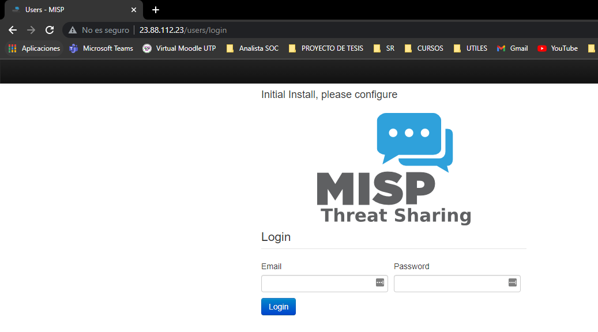
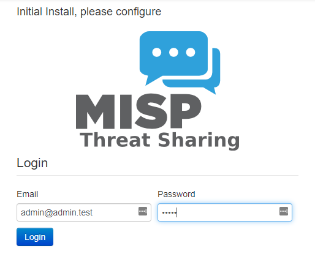

# Instalación de MISP

**MISP - Ubuntu 20.04** 


# Creación de un contenedor Docker que ejecuta una instancia de MISP en Ubuntu 20.04

## Paso 1: Actualizar las fuentes e instalar todos los paquetes disponibles

sudo apt-get update -y

```
git clone https://github.com/MISP/misp-docker
cd misp-docker
cp template.env .env
nano .env
```

## Build the containers

```
$ docker-compose build
```

## Run containers

```
$ docker-compose up
```

Para abrir MISP, abra el navegador y vaya a ...

    http://<YOUR_IP_ADDRESS>

Tienes que reemplazar con su dirección IP, ej. http://192.168.1.24.



Si no cambiamos nada, la cuenta de administrador predeterminada es:

```
Email: admin@admin.test
Password:admin
```



## Paso 16: Cambiar la contraseña de administrador

Como es la primera vez que iniciamos sesión en la plataforma, por seguridad, MISP solicitará cambiar la contraseña.


## Paso 17 - Explorar MISP

**Con todos estos pasos, hemos ejecutado con éxito una instancia de MISP en un contenedor de Docker.**


