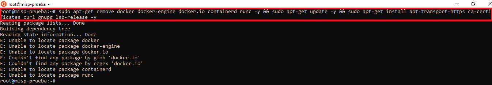
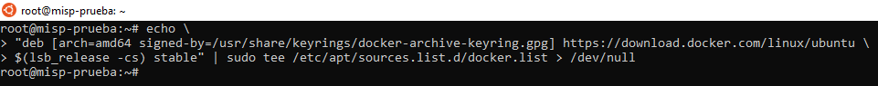
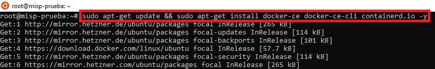
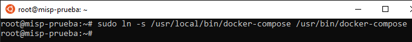
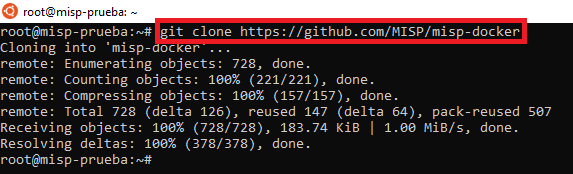
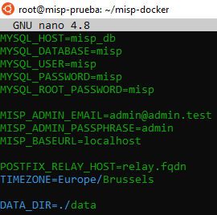
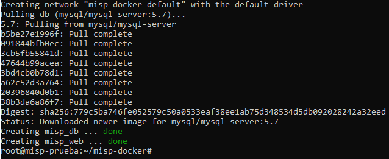

# Instalación de MISP

**MISP - Ubuntu 20.04** 

[Descargar Ubuntu 20.04](https://ubuntu.com/download/server/step2)

# Creación de un contenedor Docker que ejecuta una instancia de MISP en Ubuntu 20.04

## Paso 1: Actualizar las fuentes e instalar todos los paquetes disponibles

Actualizamos nuestras fuentes para descargar información de paquetes. Por lo tanto, ejecute el comando ***apt update*** e instale todas las actualizaciones de paquetes disponibles que están instaladas actualmente en el sistema, ejecutando el comando ***apt upgrade***. Podemos usar ***&&*** para ejecutar un comando tras otro. Pero antes removemos los componentes de *Docker* que pueden estar instalados, lo realizamos en un sólo comando.


    sudo apt-get remove docker docker-engine docker.io containerd runc -y && sudo apt-get update -y && sudo apt-get install apt-transport-https ca-certificates curl gnupg lsb-release -y



## Paso 2: instalar Docker

Descargamos la llave de cifrado del repositorio de Docker, realizando un ***curl -fsSL***


    curl -fsSL https://download.docker.com/linux/ubuntu/gpg | sudo gpg --dearmor -o /usr/share/keyrings/docker-archive-keyring.gpg


Agregamos el repositorio de Docker a la lista de repositorios de APT, realizando un ***echo***

    echo \
    "deb [arch=amd64 signed-by=/usr/share/keyrings/docker-archive-keyring.gpg] https://download.docker.com/linux/ubuntu \
    $(lsb_release -cs) stable" | sudo tee /etc/apt/sources.list.d/docker.list > /dev/null




## Paso 3: Actualizar e instalar Docker-ce | cli | contaner.io

    sudo apt-get update && sudo apt-get install docker-ce docker-ce-cli containerd.io -y



## Paso 4: Habilitar el servicio Docker

Para permitir que el servicio Docker se encienda con el sistema, podemos ejecutar el siguiente comando:

    systemctl enable docker


## Paso 5: Iniciar el servicio Docker

Para iniciar el servicio Docker, podemos ejecutar el siguiente comando:

    systemctl start docker


## Paso 6: Verificar si el servicio Docker se está ejecutando

Para verificar si el servicio Docker se está ejecutando, podemos ejecutar el siguiente comando:

    systemctl status docker


## Paso 7: Instalar Docker Compose

Instale Docker Compose porque vamos a requerir varios contenedores para ejecutar una instancia de MISP. Para instalar Docker Compose ejecutamos el siguiente comando:

    sudo curl -L "https://github.com/docker/compose/releases/download/1.29.2/docker-compose-$(uname -s)-$(uname -m)" -o /usr/local/bin/docker-compose


Le damos los permisos correspondiente para que se pueda ejecutar *docker-compose*.


Realizamos un sudo ln -s

    sudo ln -s /usr/local/bin/docker-compose /usr/bin/docker-compose



## Paso 8: Clonar el repositorio oficial de MISP

Clonamos el repositorio oficial de MISP llamado misp-docker. Para clonar un repositorio en nuestro sistema podemos ejecutar el siguiente comando:

    git clone ://github.com/MISP/misp-docker



## Paso 9: Cambiar el directorio al directorio misp-docker

Cambie el directorio al directorio ***misp-docker*** con el comando:

    cd misp-docker


## Paso 10: Copiar template.env a .env

Para copiar ***template.env*** a ***.env*** (en el directorio raíz) y editar las variables de entorno en el archivo ***.env***, tenemos que ejecutar el comando:

    cp template.env .env


## Paso 11: Abrir el archivo .env

Para abrir el archivo ***.env***, podemos ejecutar el siguiente comando:

    nano .env


En un entorno de producción tenemos que cambiar los valores predeterminados de las variables importantes como MYSQL_DATABASE, pero en este caso podemos dejar los valores predeterminados. A continuación, guarde el archivo pulsando la combinación de teclas **CTRL + O** y para salir del editor nano pulse la combinación de teclas **CTRL + X** .



## Paso 12: Construir los contenedores

Para construir los contenedores podemos ejecutar el siguiente comando:

    docker-compose build

**La construcción del contenedor puede llevar un tiempo, dependiendo de las características de su máquina.**


Esperamos que se construyan los contenedores, esta es la salida:




## Paso 13 - Verificar los contenedores en funcionamiento

Para verificar los contenedores en ejecución, podemos ejecutar el comando:

    docker ps


**Los contenedores deben estar funcionando cuando el estado sea correcto.**

## Paso 14: Borrar el valor de la variable BASEURL

En el directorio misp-docker tenemos que cambiar el directorio a **data / web / app / Config /** , podemos ejecutar el comando:

    cd misp-docker/data/web/app/Config/


Luego tenemos que abrir el archivo **config.php** . Para hacer esto podemos ejecutar el comando:

    nano config.php


En este archivo tenemos que borrar el valor de la **variable baseurl** , probablemente tenga 'localhost' como el valor de esta variable, tenemos que eliminar solo **'localhost'** y poner solo **'baseurl' => ''** como mostramos en la imagen debajo. A continuación, guarde el archivo pulsando la combinación de teclas **CTRL + O** y para salir del editor nano pulse la combinación de teclas **CTRL + X** .


## Paso 15 - Abrir MISP

Para abrir MISP, abra el navegador y vaya a ...

    http://<YOUR_IP_ADDRESS>

Tienes que reemplazar con su dirección IP, ej. http://192.168.1.24.


Si no cambiamos nada, la cuenta de administrador predeterminada es:

```
Email: admin@admin.test
Password:admin
```


## Paso 16: Cambiar la contraseña de administrador

Como es la primera vez que iniciamos sesión en la plataforma, por seguridad, MISP solicitará cambiar la contraseña.


## Paso 17 - Explorar MISP

**Con todos estos pasos, hemos ejecutado con éxito una instancia de MISP en un contenedor de Docker.**


