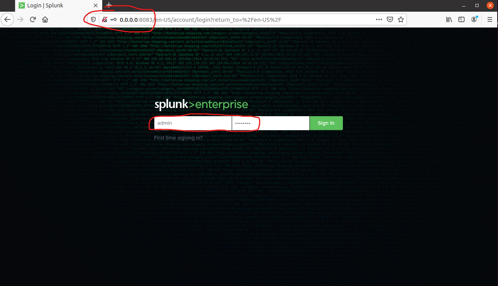

Instalación de Splunk - Actualizado 24 de Octubre de 2021 | 11:30 am
===============
Este laboratorio es para fines educativos y su contenido no debe ser utilizado para fines ilícitos. 


**Objetivos**
* Instalar la versión gratuita de Splunk 
* Familiarizar al participantes con el entorno de splunk 
* Cargar datos  

**Requisitos**
* Desde VirtuaBox, inciar las máquinas virtuales de Kali Linux y Ubuntu Server 20.04
* Realizar un snapshot de la VM Ubuntu 20.04 para que pueda restarurarla en caso de ser necesario.
* Identificar dirección IP del host - Ubuntu Server 20.04. Desde la termimal de este servidor escriba ese comando: 
``` 
ifconfig
``` 
Ahora anote la dirección, debe algo parecido a 10.0.2.15

Detalles a considerar 
* Las VM deben estar en la misma red NAT
* verificar que puedas llegar a cada máquina con el comando ping

* Conexion Remota al servidor 
Desde Kali. 

Debe utilizar el IP de su servidor ubuntu 20.04 y utilizar las credenciales compartidad en el canal en Discord.
 
**_NOTA:_**  Reemplase usuario y dirección IP por los asociados a su servidor ubuntu 20.04

``` 
ssh usuario@direcciónIP
``` 
* Elevemos privilegios, para facilitar el ejercio.
``` 
sudo su
``` 

* Actualizar eñ repositorio de paquetes del sistema operativo**
```
apt-get update && apt-get upgrade -y
```
A continuación, descargaremos los paquetes Dockers y los actualizaremos a la versión más reciente con los siguientes comandos:

```
sudo apt-get install apt-transport-https ca-certificates curl gnupg lsb-release -y
```
```
 curl -fsSL https://download.docker.com/linux/ubuntu/gpg | sudo gpg --dearmor -o /usr/share/keyrings/docker-archive-keyring.gpg
 ```
 ```
 echo \ "deb [arch=amd64 signed-by=/usr/share/keyrings/docker-archive-keyring.gpg] https://download.docker.com/linux/ubuntu/ $(lsb_release -cs) stable" | sudo tee /etc/apt/sources.list.d/docker.list > /dev/null
 ```
 ```
apt-get update && apt-get upgrade -y
 ```
 ```
  apt-get install docker-ce docker-ce-cli containerd.io -y
````
Y por último, habilitaremos dockers para que se inicie al arrancar el ordenador y luego iniciaremos el servicio nosotros mismos de forma manual. Utiliza el siguiente comando:
```
systemctl enable docker && systemctl start docker
```
```
sudo curl -L "https://github.com/docker/compose/releases/download/1.29.2/docker-compose-$(uname -s)-$(uname -m)" -o /usr/local/bin/docker-compose
```
```
sudo chmod +x /usr/local/bin/docker-compose
```
```
docker-compose version
```
Procedamos a crear un archivo de configuración para utilizar la imagen de Splunk
```
nano docker-compose.yml 
```
Copie todo el contenido siguiente desde version:2 hasta splunk-data:/opt/splunk en el archivo docker-compose.yml

Guarde y cierre el archivo (Ctrl+x  luego Y, favor leer la barra de estado se explica o leer sobre el uso del editor nano)
```
version: "2"

networks:
  splunknet:
    driver: bridge

volumes:
  splunk-data: {}

services:
  splunk:
    networks:
      splunknet:
        aliases:
          - splunk
    image: splunk/splunk
    restart: always
    container_name: splunk
    environment:
      - SPLUNK_START_ARGS=--accept-license
      - SPLUNK_PASSWORD=d0j02020
      - DEBUG=true
    ports:
      - 8083:8000
      - 8084:8089
    volumes:
      - splunk-data:/opt/splunk
```

Ahora descargamos e instalamos la imagen de Splunk desde el hub Docker usando los datos del archivo .yml que acabamos de crear usando el siguiente código docker-compose up. Este comando también nos permitirá ejecutar splunk para que podamos acceder a la interfaz web y empezar a utilizarla.

```
docker-compose up -d
```

Ahora abrimos firefox, para acceder al splunk desde la web
escriba: 

```
/usr/bin/firefox --new-window 10.0.2.5:8083 
```

* usuario : admin
* contraseña: d0j02020




Felicidades ya lograste instalar Splunk


Para mayor información
* [Sitio oficial de Splunk] (https://www.splunk.com/)
* [Curso gratuito oficial de Splunk] (https://www.splunk.com/en_us/training/free-courses/)(splunk-fundamentals-1.html)

Video explicativo de como realizar el laboratorio. 
 https://www.youtube.com/watch?v=KPWWN522xj0

Créditos por el video:
Magdiel Gutiérrez
https://www.linkedin.com/in/magdielgutierrez/