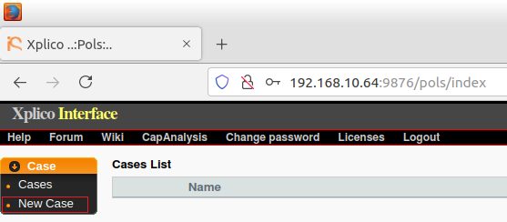

Preparando el ambiente

Paso 1 - Actualicemos e instalemos los paquete para el sistema operativo 
```
apt update && apt upgrade -y
```
Paso 2 - Instalar Docker

```
apt install docker.io
```
Paso 4 habilitamos el servicio de Docker

```
systemctl enable docker
```
Paso 5  - Iniciamos el servicio
```
systemctl start docker
```
Paso 6 - Verificamos el estado 
```
systemctl status docker
```
Instalación y configuración de Xplico

Paso 1 - Movernos a la carpera /opt y clonar la repor de xplico
```
cd /opt
```
```
git clone https://github.com/geekscrapy/docker-xplico.git
```

Step 3 - Desplegar la imagen de Docker
```
cd docker-xplico
```
```
docker build -t xplico .
```
Paso 4- crear un archivo con la receta para el despliegue
```
sudo nano docker-compose.yaml
```
copiar y pegar tal como aparecen este contendido en el archivo docker-compose
```
version: &#39;3.3&#39;
services:
xplico:
build: .
image: xplico

hostname: xplico
container_name: xplico
ports:
- 9876:9876
restart: always/
```

Para cerrar ctrl X y luego responder Y al mensaje 
```
docker run --rm -d -p 9876:9876 --name xplico xplico
```

Iniciando Sesion 
desde su navegador web de su preferencia introduzca
```
http://ip de su servidor:9876
```
Inicie sesion con las contraseñas por defecto
User: xplico 
Password: xplico 
Step 1 - Create a new case
After login in to the Xplico interface, create a new case. For this, go to case, then new case.



Step 2 - Select Upload PCAP capture file(s)
Select the option "Upload PCAP capture file(s)". Write a name and click on create.

lab04 - 1.png

Step 3 - Enter to the Case
Click on the case name.

img21

Step 4 - Create new Session
You must create a new session. Click on new session and give it a name.

img22 img23

Step 5 - Enter the created session
Here we can see the section we created. Now, click on the section name.

img24

Step 6 - Load PCAP
Browse for the pcap file we are going to use and click on upload.

img25 img26

Step 7 - Decoding
After clicking on load in the data part of the session, it will start decoding, wait for it to complete.

img27 img28

Step 8 - See outputs
In the decoded part we can see that I decode 801 text flows.

img30

Step 9 - Search in the TCP-UDP menu
If you go to the left panel, you can see the Undecoded menu, click on TCP-UPD.

img29

Step 10 - Information
Here we can see the date, destination, port, protocol, duration, size and information. img31

Step 11 - Search site in the menu
If you go to the left panel, you can see the Web menu, click on “site.”

img32

Step 12 - Site
Here we can get information from html, images, flash, videos, audio, json, etc.

img33

We can also filter what we want to see.

img34

Step 13 - DNS
Go to the left panel to see the Graphs menu, click on DNS.

You will be able to see information such as host, date, CName, IP, and others.

img35

