# MISP: Primeros pasos

## Introducción

MISP (*Malware Information Sharing Platform*) es un software de código abierto centrado en "*Threat Intelligence*". MISP nos ofrece una serie de beneficios, como compartir información de inteligencia de amenazas, compartir *IOC's* que nos brindan malware de un ataque que se ha realizado en otra organización o en la nuestra, toda esta información se puede compartir dentro de la empresa o exportar y compartir con otros.

También facilita la automatización de procesos con malware, nos permite trabajar con estándares para compartir información sobre malware como STIX, APIs, y además cuenta con librerías de Python como *PyMISP*.

## Guión

Esta guía es para personas que no saben cómo comenzar con MISP. Conocer y comenzar a utilizar esta plataforma nos ayudará a agilizar nuestros procesos para proteger a una organización del malware. Como se mencionó anteriormente, esta plataforma es de código abierto, pero ofrece muchos beneficios cuando se trata de compartir información sobre malware y cómo lidiar con él, protegiendo a la organización del malware presente y futuro. Además, muchas organizaciones de todo el mundo están utilizando MISP y otras están empezando a utilizarlo.

## Objetivos

Los objetivos de esta guía son demostrar:

- *Feeds*
- Gestión de *feeds*
- Adición de *feeds*
- Crear una organización
- Agregar usuarios
- Roles
- Agregar roles
- Crear un evento
- Agregar atributos
- Rellenar usando una plantilla

# Feeds

Los *feeds* son recursos remotos o locales que contienen indicadores que se pueden importar automáticamente a MISP a intervalos regulares. Los *feeds* se pueden estructurar en formato MISP, formato CSV o incluso en formato de texto libre.

## Administrar *feeds*

Para administrar los *feeds*, primero debemos ir a la página *Feeds*, así que, haga clic en ***Sync Actions*** en el menú superior y luego haga clic en ***List Feeds***.

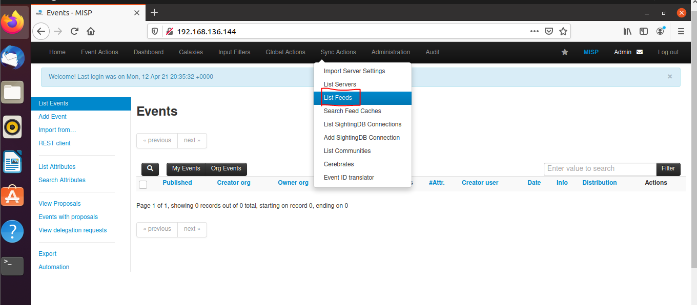

Aquí veremos la página *Feeds*, con una tabla de *feeds* configurados. Solo tenemos 2 *Feeds* predeterminados y hay deshabilitados, revisarlos y habilitar cada uno.

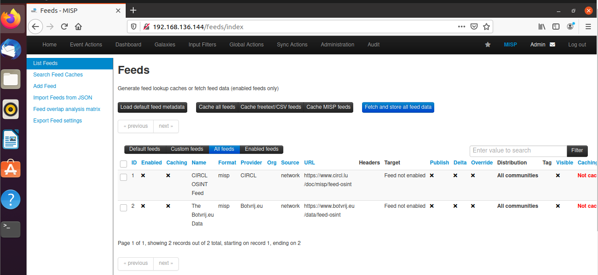

## Agregar *feeds*

Para agregar una nueva *feed*, haga clic en la opción ***Add Feeds*** en el menú lateral izquierdo.

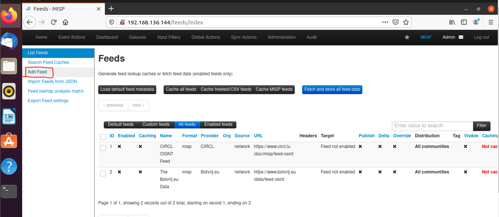

Aquí tendrá acceso a un formulario dinámico. Revisemos cada campo por orden.

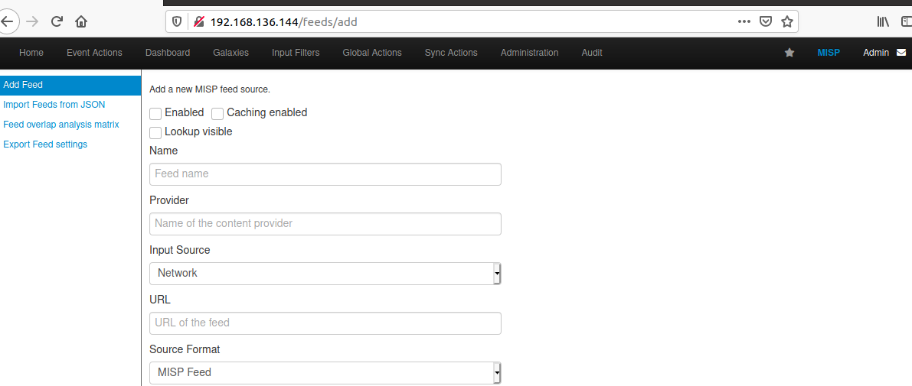

**Habilitado:** ¿El *feed* está activo o no?.

**Almacenamiento en caché habilitado:** Si los datos del *feed* se almacenan en caché. 

**Búsqueda visible:** Si no está marcado, las correlaciones solo se mostrarán para usted; si se marca, las correlaciones también son visibles para otros usuarios. 

**Nombre:** Nombre para identificar el *feed*; no se requiere que sea único.

**Proveedor:** Nombre del proveedor de contenido.

**Fuente de entrada:** De dónde proviene la entrada.

**Red:** alojado en algún lugar fuera de la plataforma.

**Local** **:** alojado en el servidor local. En este caso, aparecerá una nueva casilla de verificación "Eliminar entrada después de la ingestión". Si se marca, la fuente se elimina después de su uso. 

**URL:** URL del feed, donde se encuentra (para archivos alojados locales, apunte a manifest.json; por ejemplo: [/home/cwa/feed-generator/output/manifest.json](/home/cwa/feed-generator/output/manifest.json) )

**El formato de origen puede ser:**

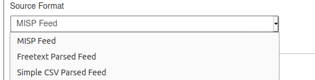

**Feed MISP:** la fuente apunta a una lista de archivos con formato JSON como eventos MISP. [Ejemplo](https://www.circl.lu/doc/misp/feed-osint) 

**Distribución:** La opción de distribución que se establecerá en el evento creado a partir del *feed*. Las opciones son:

**Etiqueta predeterminada:** Se puede agregar una etiqueta predeterminada a los eventos creados. 

**Reglas de filtrado:** Aquí puede definir qué etiquetas u organizaciones están permitidas o bloqueadas.

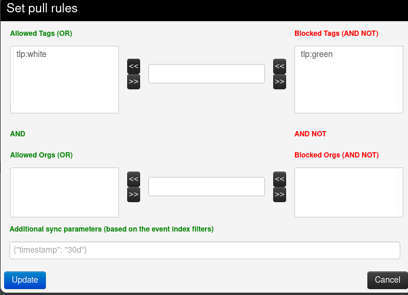

# Organizaciones

Una organización es una asociación de un conjunto de usuarios que tienen un propósito común o que tienen similitudes entre ellos. Cada usuario pertenece a una organización. Como administrador, puede administrar estas organizaciones.

## Crea una organización

Haga clic en **Administration** en el menú superior y luego haga clic en ***Add Organizations***.

Escriba el NOMBRE DE LA ORGANIZACIÓN en el Identificador de la organización, luego haga clic en **Generar UUID**, luego, opcionalmente, podemos escribir una descripción, vincular usuario, contactos o imágenes.

**Organización local:** Si la organización debe tener acceso a esta instancia, marque la casilla de verificación. Si solo desea agregar una organización externa conocida para su inclusión en grupos para compartir, desmárquela.

**Identificador de organización:** Nombre su organización. Si desea agregar una imagen, debe agregar un archivo en el servidor web usando el 'Menú de configuración del servidor'. La imagen debe tener el mismo nombre. Para obtener más información sobre el menú de configuración del servidor, haga clic aquí.

**Uuid:** Identificador único. Si desea compartir la organización entre múltiples instancias de MISP, use el mismo Uuid.

**Una breve descripción de la organización:** Una palabra para describir la organización.

**Nacionalidad:** Una lista desplegable para seleccionar el país de la organización.

**Sector:** Defina el sector de la organización (financiero, transporte, telecomunicaciones…)

**Tipo de organización:** Defina el tipo de organización.

**Contactos:** Puede agregar algunos detalles de contacto para la organización.

Haga clic en ***Submit***.

Y aquí está nuestra Organización.

# Usuarios

Como administrador (que no debe confundirse con el administrador de la organización), puede configurar nuevas cuentas para los usuarios, editar perfiles de usuario, eliminarlos o simplemente echar un vistazo a todos los perfiles de los espectadores. Los administradores de la organización están restringidos a ejecutar estas acciones exclusivamente dentro de los usuarios de su propia organización.

## Agregar un nuevo usuario

### Paso 1: haga clic en Agregar usuario.

Haga clic en ***Administration*** en el menú superior y luego haga clic en ***Add User***.

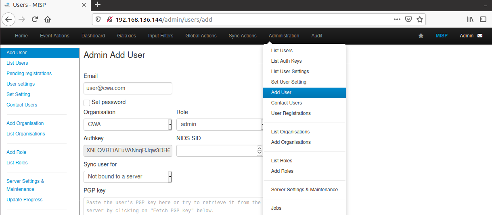

### Paso 2: ingrese un nombre para el correo electrónico

Ingrese "nombre @ <FQDN>" para el correo electrónico

### Paso 3 - Poner una contraseña

Marque "Establecer contraseña" y ponga una contraseña.

### Paso 4: seleccione un nuevo ORG

Seleccione "<nuevo nombre de la organización>" para Organización

### Paso 5: seleccione ORG para el rol

Seleccione "ORG" para Rol.

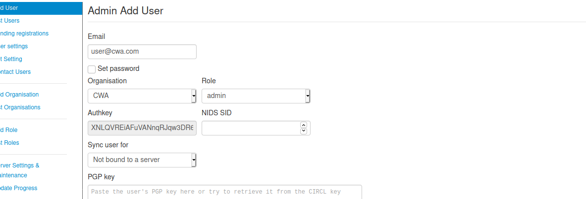

### Paso 6: haga clic en el botón Crear usuario

Para agregar nuestro nuevo usuario, haga clic en el botón ***Create User***.

Y aquí está nuestro nuevo usuario.

# Roles

Los roles son los permisos que tienen un conjunto de usuarios, que deciden lo que pueden y no pueden hacer. Los grupos de reglas utilizan una de las cuatro opciones que determinan lo que pueden hacer con los eventos, así como cuatro configuraciones adicionales de elevación de privilegios. Estas son las cuatro opciones para editar todas las opciones disponibles en la sección Roles: Solo lectura, Administrar mis propios eventos, Administrar eventos de la organización, Administrar y publicar eventos de la organización. A continuación se proporciona una breve descripción:

**Solo lectura:** Permite a un usuario explorar eventos a los que su organización tiene acceso, pero no permite que se realicen cambios en la base de datos.

**Administrar mis propios eventos:** Permite a los usuarios crear, modificar o eliminar sus propios eventos, pero no pueden publicarlos.

**Administrar eventos de la organización:** Permite a los usuarios crear eventos o modificar y eliminar eventos creados por un miembro de su organización.

**Administrar y publicar eventos de la organización:** Otorga a los usuarios el derecho a hacer todo lo anterior y a publicar los eventos de su organización.

En la plataforma del MISP tenemos otros permisos extra, estos se definen a continuación:

- **Administrador permanente :** otorga al usuario privilegios de administrador limitados; esta configuración se usa para los administradores de una organización.
- **Auditoría permanente:** Otorga acceso a los registros. Con la excepción de los administradores del sitio, solo son visibles los registros generados por la propia organización del usuario.
- **Etiquetador permanente:** Permite a un usuario asignar etiquetas a eventos.
- **Grupo de intercambio permanente:** Conceda acceso para editar o crear grupos de intercambio.
- **Administrador permanente del sitio:** Otorga al usuario privilegios de administrador completos; esta configuración se utiliza para los administradores del sitio.
- **Autenticación permanente:** Esta configuración permite que la clave de autenticación de los usuarios del rol se utilice para solicitudes de descanso.
- **Editor de etiquetas permanente:** Otorga acceso para editar o crear etiquetas.
- **Delegado permanente:** conceda acceso para delegar la publicación de un evento a una organización de terceros.
- **Sincronización permanente:** esta configuración permite que los usuarios del rol se utilicen como usuarios de sincronización. La clave de autenticación de este usuario se puede entregar al administrador de una instancia remota de MISP para permitir que funcionen las funciones de sincronización.
- **Acceso Regexp permanente:** permite a los usuarios que tienen este permiso habilitado editar la tabla de expresiones regulares. Tenga cuidado al otorgar este permiso, las expresiones regulares incorrectas pueden ser muy dañinas (bucles infinitos, pérdida de datos, etc.).
- **Plantilla permanente:** conceda acceso para crear o modificar plantillas.

## Agregar roles

Haga clic en ***Administration*** en el menú superior y luego haga clic en ***Add Roles***.

Aquí tenemos que nombrar el nuevo rol, asignar permisos y permisos extra, opcionalmente podemos establecer límite de memoria y tiempo máximo de ejecución.

Para agregar el nuevo rol, haga clic en el botón ***Submit***.

Aquí está nuestro nuevo rol.

# Eventos

Los eventos MISP son encapsulaciones de información relacionada contextualmente representada como atributo y objeto.

## Crear un evento

### Paso 1: haga clic en la opción Agregar evento

Para agregar un nuevo evento, haga clic en la opción ***Add Event*** en el menú lateral.

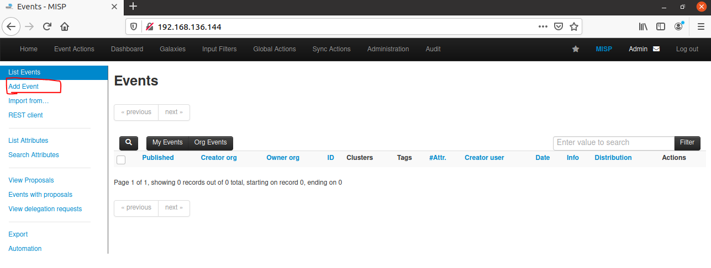

Solo tenemos que agregar algunos datos para registrar nuestro Evento. Se especificarán más detalles después de que se haya agregado el evento.

Aquí solo tenemos que especificar la fecha, distribución (organización, su comunidad, toda la comunidad, etc.), nivel de amenaza, análisis (inicial, en curso, finalizado), información del evento (descripción breve), eventos extendidos.

Haga clic en el botón ***Submit*** para agregar el evento.

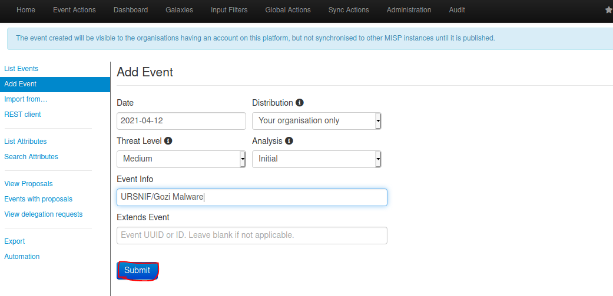

Ahora podemos especificar la información de nuestro evento.

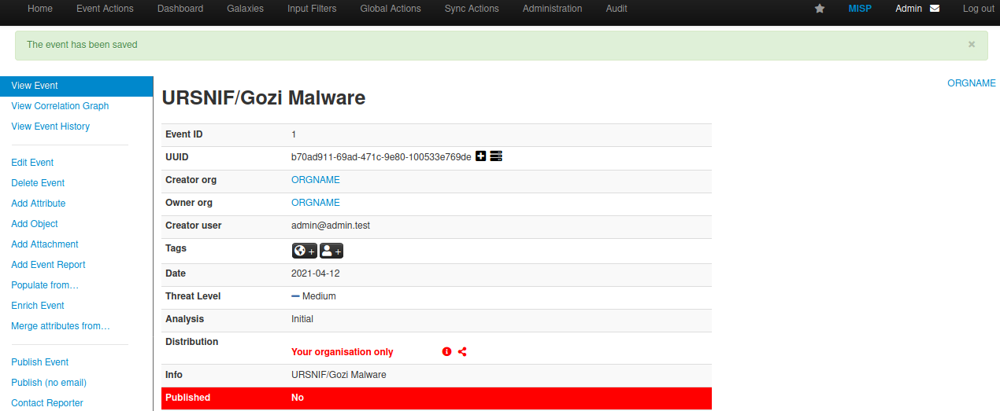

Tenemos que desplazarnos hacia abajo y hacer clic en este botón ***"Populate using a template"*** para agregar un atributo con una plantilla.

Elija el tipo de elemento, en este caso elegiré Lista de indicadores.

En esta plantilla podemos escribir hashes de malware e indicadores de red como URL, dominio, nombre de host e ip dst de malwares. En este caso pongo un SHA256 HASH del malware. Luego haga clic en el botón ***Add***.

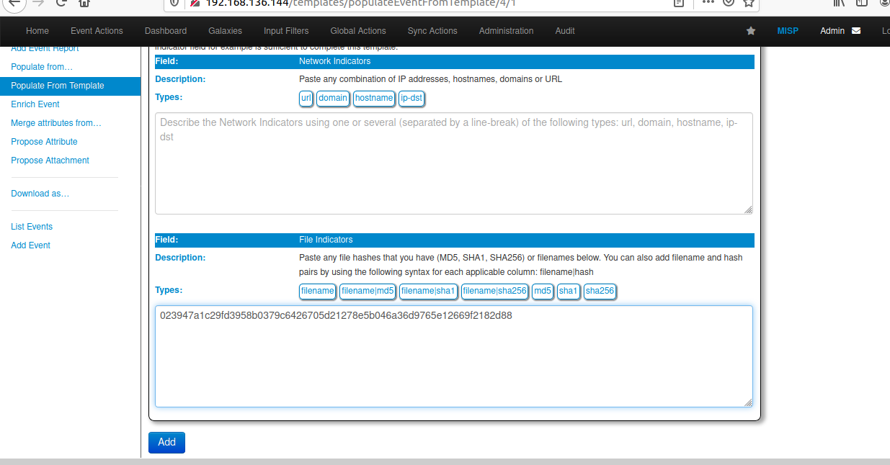

Si no hemos terminado podemos modificar la plantilla, de lo contrario podemos hacer clic en ***Finalise***.

Aquí está el HASH, ahora MISP puede detectar eventos de malware URSNIF con este HASH. Obviamente, cuantos más atributos y datos, mejor, pero depende de nosotros explorar la plataforma.

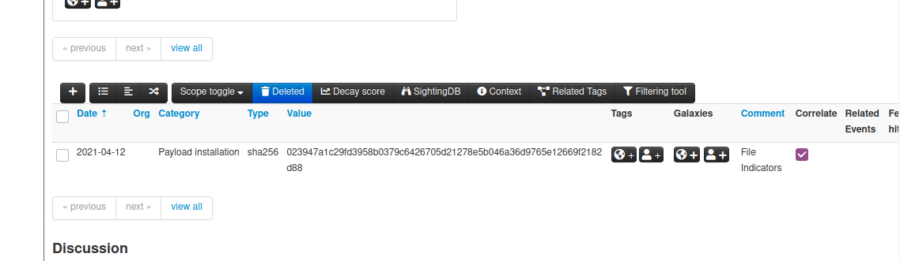

Si hacemos clic en el botón ***“+”*** podemos agregar más atributos.

En el menú lateral, tenemos otras opciones interesantes para agregar más información y ver más información sobre nuestro evento.

